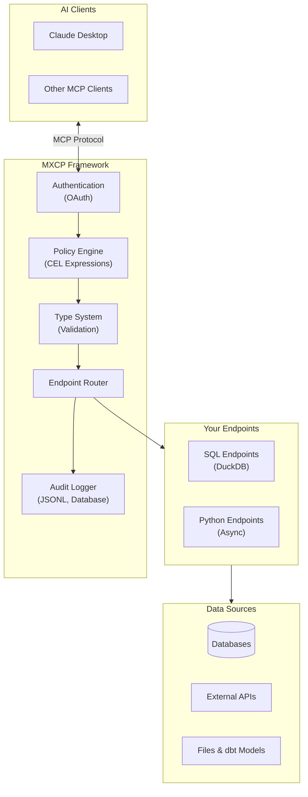
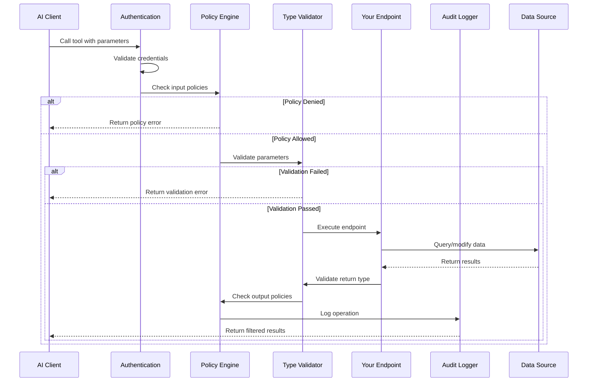
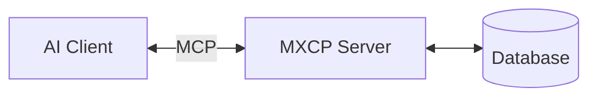
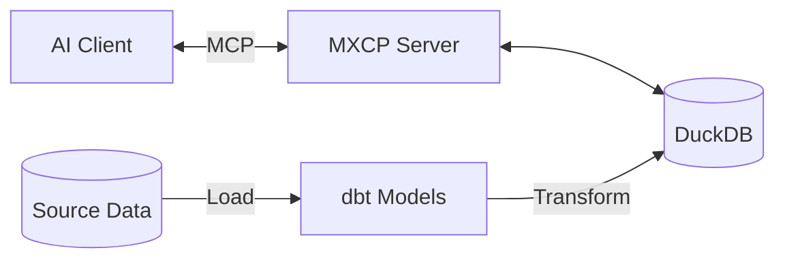

This guide provides an in-depth look at how MXCP works. For a quick start, see the [Quickstart Guide](/getting-started/quickstart/). For terminology, see the [Glossary](/getting-started/glossary/).

## What is MXCP?

MXCP (Model Context Protocol eXtension Platform) is an enterprise-grade framework for building production-ready AI tools. It extends the [Model Context Protocol (MCP)](https://modelcontextprotocol.io/) with security, testing, and operational features.

### MCP Basics

The Model Context Protocol enables AI assistants like Claude to interact with external systems. MCP servers expose:

- **Tools** - Functions AI can call (query data, create records, perform actions)
- **Resources** - Data AI can read (profiles, documents, configurations)
- **Prompts** - Reusable templates for consistent AI interactions

## What MXCP Adds

While MCP defines the protocol, MXCP provides the complete framework for building production systems:



### Security & Governance

- **Authentication** - OAuth providers (GitHub, Google, Atlassian, Salesforce, Keycloak)
- **Policy Enforcement** - Fine-grained access control using CEL expressions
- **Audit Logging** - Track every operation for compliance and debugging

### Developer Experience

- **SQL Endpoints** - Write tools using SQL with DuckDB's powerful analytical engine
- **Python Endpoints** - Build complex logic with async Python functions
- **Type Safety** - Comprehensive parameter and return type validation

### Quality Assurance

- **Validation** - Verify endpoints match their specifications
- **Testing** - Unit tests with assertions for results, errors, and policies
- **Linting** - Improve how AI models understand and use your tools
- **Evals** - Test AI behavior with your endpoints

### Operations

- **Drift Detection** - Monitor schema changes across environments
- **Hot Reload** - Update configuration without restarting
- **Observability** - OpenTelemetry integration for tracing and metrics

## How It Works

MXCP projects consist of a configuration file and endpoint definitions. Here's what each part looks like:

### Project Configuration

Every MXCP project starts with `mxcp-site.yml`:

```yaml
mxcp: 1
project: my-project
profile: default

profiles:
  default:
    duckdb:
      path: data/app.duckdb
```

### Endpoint Definition

Tools are defined in YAML files with parameters, return types, and SQL or Python source:

```yaml title="tools/search_users.yml"
mxcp: 1
tool:
  name: search_users
  description: Search for users by name or email

  parameters:
    - name: query
      type: string
      description: Search term

  return:
    type: array
    items:
      type: object
      properties:
        id: { type: integer }
        name: { type: string }
        email: { type: string }

  source:
    code: |
      SELECT id, name, email
      FROM users
      WHERE name ILIKE '%' || $query || '%'
      LIMIT 10
```

### Policy Protection

Sensitive operations can be protected with CEL policy expressions:

```yaml
policies:
  input:
    - condition: "user.role != 'admin'"
      action: deny
      reason: "Only administrators can delete users"
```

### Built-in Testing

Each endpoint can include tests that verify behavior:

```yaml
tests:
  - name: search_finds_alice
    arguments:
      - key: query
        value: "alice"
    result_contains_item:
      name: "Alice Smith"
```

:::tip[Ready to build?]
See the [Quickstart Guide](/getting-started/quickstart/) for a complete hands-on tutorial, or try `mxcp init --bootstrap` to generate a working example project.
:::

## Request Flow

Here's what happens when an AI calls one of your tools:



## Architecture Patterns

MXCP supports different architectural patterns depending on your needs:

### Simple: Single Server

For small projects or development:



### Production: With dbt

For data-driven applications:



## Comparison with Other Approaches

| Feature | Plain MCP | MXCP |
|---------|-----------|------|
| Protocol Support | Yes | Yes |
| Authentication | Manual | Built-in OAuth |
| Authorization | Manual | CEL Policies |
| Audit Logging | No | Built-in |
| Type Validation | Basic | Comprehensive |
| Testing Framework | No | Built-in |
| SQL Endpoints | No | DuckDB |
| Python Endpoints | Manual | Integrated |
| dbt Integration | No | Built-in |
| Observability | No | OpenTelemetry |
| Drift Detection | No | Built-in |
| Hot Reload | No | Built-in |
| Linting | No | Built-in |
| AI Evals | No | Built-in |

## Summary

MXCP provides:
- **Protocol Compliance** - Full MCP implementation
- **Enterprise Security** - OAuth authentication, CEL policies, audit logging
- **Flexible Implementation** - SQL endpoints with DuckDB, Python for complex logic
- **Type Safety** - Comprehensive parameter and return type validation
- **Data Integration** - Built-in dbt support for data transformation pipelines
- **Quality Assurance** - Validation, testing, linting, AI evals
- **Production Operations** - OpenTelemetry observability, drift detection, hot reload

## Next Steps

| Goal | Next Step |
|------|-----------|
| Understand terminology | [Glossary](/getting-started/glossary/) |
| Build something now | [Quickstart](/getting-started/quickstart/) |
| Learn step-by-step | [Hello World Tutorial](/tutorials/hello-world/) |
| Deep dive into concepts | [Core Concepts](/concepts/) |
