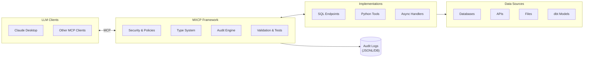

MXCP (Model Context Protocol eXtension Platform) is an enterprise-grade framework for building production-ready AI tools. It provides the complete methodology for creating secure, testable, and governable AI applications using SQL or Python.

## What is MCP?

The [Model Context Protocol (MCP)](https://modelcontextprotocol.io/) is an open standard that enables AI assistants like Claude to interact with external tools, data sources, and systems. MCP defines three types of endpoints:

- **Tools** - Functions the AI can call to perform actions
- **Resources** - Data the AI can read (like files or database records)
- **Prompts** - Reusable prompt templates

MXCP builds on MCP by adding enterprise features: security, testing, policies, and audit trails.

## Why MXCP?

While other MCP servers focus on quick integrations, MXCP provides a **structured approach** to building production AI tools:

1. **Data Quality First** - Start with proper data modeling using dbt
2. **Service Design** - Define comprehensive type systems and security policies
3. **Smart Implementation** - Use SQL for data queries, Python for complex logic
4. **Quality Assurance** - Validate, test, lint, and evaluate at every level
5. **Production Operations** - Monitor drift, track operations, and scale securely

## Core Features

### Security & Governance
- **OAuth Authentication** - GitHub, Atlassian, Salesforce, Google, Keycloak
- **Policy Enforcement** - Fine-grained access control with CEL expressions
- **Audit Logging** - Track every operation for compliance

### Developer Experience
- **SQL Endpoints** - Query data with DuckDB's analytical engine
- **Python Endpoints** - Build complex logic with the full Python ecosystem
- **Type Safety** - Comprehensive validation across all languages

### Quality & Testing
- **Validation** - Ensure endpoints meet specifications
- **Testing** - Unit tests with various assertions
- **Linting** - Improve LLM understanding of your tools
- **Evals** - Test how AI models interact with your endpoints

### Operations
- **Drift Detection** - Monitor schema changes across environments
- **Hot Reload** - Refresh configuration without downtime
- **Observability** - OpenTelemetry integration for tracing and metrics

## Quick Start

Install MXCP:

```bash
pip install mxcp
```

Create a new project:

```bash
mkdir my-mxcp-project
cd my-mxcp-project
mxcp init --bootstrap
```

Start the server:

```bash
mxcp serve
```

Your AI tools are now available with full security, audit trails, and policy enforcement.

## Architecture



## Documentation Structure

### Getting Started
- [Quickstart](/getting-started/quickstart) - Get running in 5 minutes
- [Installation](/getting-started/quickstart#install-mxcp) - Install MXCP and dependencies

### Core Concepts
- [Endpoints](/concepts/endpoints) - Tools, resources, and prompts
- [Type System](/concepts/type-system) - Parameter and return type definitions
- [Project Structure](/concepts/project-structure) - Directory organization

### Tutorials
- [Hello World](/tutorials/hello-world) - Your first MXCP tool
- [SQL Endpoints](/tutorials/sql-endpoints) - Query data with SQL
- [Python Endpoints](/tutorials/python-endpoints) - Build complex logic

### Security
- [Authentication](/security/authentication) - OAuth provider setup
- [Policies](/security/policies) - Access control with CEL expressions
- [Audit Logging](/security/auditing) - Track operations for compliance

### Operations
- [Configuration](/operations/configuration) - Site and user configuration
- [Deployment](/operations/deployment) - Docker, systemd, production patterns
- [Monitoring](/operations/monitoring) - Observability and drift detection

### Quality
- [Validation](/quality/validation) - Check endpoint correctness
- [Testing](/quality/testing) - Write and run tests
- [Linting](/quality/linting) - Improve LLM comprehension
- [Evals](/quality/evals) - AI behavior testing

### Integrations
- [Claude Desktop](/integrations/claude-desktop) - MCP client setup
- [dbt](/integrations/dbt) - Data transformation pipelines
- [DuckDB](/integrations/duckdb) - Extensions and features

### Reference
- [CLI](/reference/cli) - Command-line interface
- [YAML Schemas](/schemas/) - Complete field reference for all YAML files
- [SQL Functions](/reference/sql) - Built-in authentication functions
- [Python Runtime](/reference/python) - Runtime API reference
- [Plugins](/reference/plugins) - Extend DuckDB with custom UDFs

### Contributing
- [Development Guide](/contributing/) - Setup and architecture
- [Code Style](/contributing/#2-code-style) - Formatting and conventions

## Learning Paths

Choose the path that matches your goal:

### I'm New to MXCP
1. [Glossary](/getting-started/glossary) - Understand key terms (5 min)
2. [Quickstart](/getting-started/quickstart) - Create your first project (10 min)
3. [Hello World Tutorial](/tutorials/hello-world) - Build and test a tool (15 min)
4. [Concepts](/concepts/) - Understand how MXCP works

### I'm Building AI Tools
1. [SQL Endpoints](/tutorials/sql-endpoints) - Query data with SQL
2. [Python Endpoints](/tutorials/python-endpoints) - Complex logic and APIs
3. [Examples](/examples/) - Real-world patterns
4. [Common Tasks](/reference/common-tasks) - Quick how-to reference

### I'm Adding Security
1. [Security Overview](/security/) - Understand the security model
2. [Authentication](/security/authentication) - Set up OAuth
3. [Policies](/security/policies) - Access control with CEL
4. [Auditing](/security/auditing) - Track operations

### I'm Going to Production
1. [Configuration](/operations/configuration) - Environment management
2. [Deployment](/operations/deployment) - Docker and systemd
3. [Monitoring](/operations/monitoring) - Observability setup
4. [Quality](/quality/) - Testing and validation

## Quick Links

| Task | Documentation |
|------|---------------|
| Create a tool | [Hello World Tutorial](/tutorials/hello-world) |
| Add authentication | [Authentication Guide](/security/authentication) |
| Filter sensitive data | [Policies Guide](/security/policies) |
| Write tests | [Testing Guide](/quality/testing) |
| Deploy to production | [Deployment Guide](/operations/deployment) |
| Look up CLI commands | [CLI Reference](/reference/cli) |
| Find common patterns | [Common Tasks](/reference/common-tasks) |
