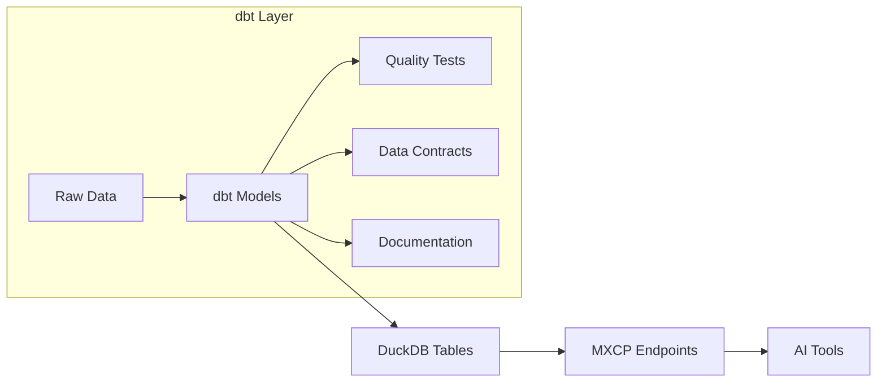
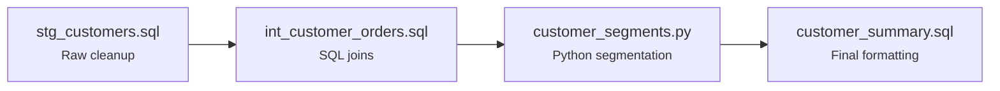
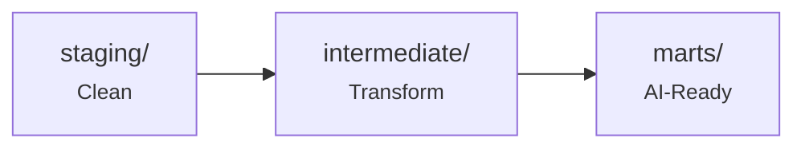

## Table of Contents

- [Why dbt?](#why-dbt)
- [The dbt + MXCP Workflow](#the-dbt--mxcp-workflow)
- [Configuration](#configuration)
- [Commands](#commands)
- [Project Structure](#project-structure)
- [Creating Models](#creating-models)
- [Materialization](#materialization)
- [Advanced Configuration](#advanced-configuration)
- [Data Quality Tests](#data-quality-tests)
- [Documentation](#documentation)
- [MXCP Integration](#mxcp-integration)
- [Python Models](#python-models)
- [Performance Optimization](#performance-optimization)
- [CI/CD Integration](#cicd-integration)
- [Best Practices](#best-practices)
- [Troubleshooting](#troubleshooting)

> **Related Topics:** [Configuration](/operations/configuration) (enable dbt) | [SQL Endpoints](/tutorials/sql-endpoints) (query dbt models) | [DuckDB Integration](/integrations/duckdb) (database engine) | [Common Tasks](/reference/common-tasks#how-do-i-integrate-with-dbt) (quick how-to)
>
> **Official Documentation:** [dbt Docs](https://docs.getdbt.com) | [dbt-duckdb Adapter](https://docs.getdbt.com/docs/core/connect-data-platform/duckdb-setup)

dbt (data build tool) is the data quality layer in MXCP's production methodology. It transforms raw data into well-structured models that AI can consume reliably.

## Why dbt?

dbt serves as your data quality foundation:

1. **Data Modeling**: Transform raw data into clean, structured models
2. **Quality Testing**: Validate data before AI consumption
3. **Performance**: Materialize views for fast query response
4. **Documentation**: Generate clear documentation for data models
5. **Version Control**: Track all transformations in Git

## The dbt + MXCP Workflow



This ensures:
- AI tools work with clean, validated data
- Performance is optimized through materialization
- Changes are tracked and tested before deployment
- Data quality issues are caught early

## Configuration

### Enable dbt

In your `mxcp-site.yml`:

```yaml
mxcp: 1
project: my-project
profile: dev

dbt:
  enabled: true
  model_paths: ["models"]  # Paths to dbt model directories
```

### Generate Configuration

Generate dbt configuration files:

```bash
# Generate dbt config files
mxcp dbt-config

# Preview without writing
mxcp dbt-config --dry-run

# Embed secrets (use with caution)
mxcp dbt-config --embed-secrets --force
```

This creates:
- `dbt_project.yml` - Project configuration
- `profiles.yml` - Connection profiles
- `models/` - Model directory structure

## Commands

### mxcp dbt-config

Manages dbt configuration:

```bash
# Generate config files
mxcp dbt-config

# Show what would be written
mxcp dbt-config --dry-run

# Embed secrets in profiles.yml
mxcp dbt-config --embed-secrets --force
```

### mxcp dbt

Wrapper around dbt CLI with secret injection:

```bash
# Run all models
mxcp dbt run

# Run specific models
mxcp dbt run --select my_model

# Run models and dependencies
mxcp dbt run --select +my_model

# Run tests
mxcp dbt test

# Run specific tests
mxcp dbt test --select my_model

# Generate documentation
mxcp dbt docs generate

# Serve documentation
mxcp dbt docs serve
```

## Project Structure

Recommended structure for dbt with MXCP:

```
my-project/
├── mxcp-site.yml
├── dbt_project.yml           # Generated
├── profiles.yml              # Generated
├── models/
│   ├── staging/              # Raw data cleanup
│   │   ├── stg_customers.sql
│   │   └── stg_orders.sql
│   ├── intermediate/         # Business logic
│   │   └── int_customer_orders.sql
│   └── marts/                # Final models for AI
│       ├── customer_summary.sql
│       └── order_analytics.sql
├── tests/                    # Data tests
│   └── assert_valid_emails.sql
└── tools/                    # MXCP endpoints
    ├── get_customer.yml
    └── search_orders.yml
```

## Creating Models

### Staging Models

Clean raw data:

```sql title="models/staging/stg_customers.sql"
SELECT
    id as customer_id,
    TRIM(name) as customer_name,
    LOWER(email) as email,
    created_at
FROM raw_customers
WHERE email IS NOT NULL
```

### Intermediate Models

Apply business logic:

```sql title="models/intermediate/int_customer_orders.sql"
SELECT
    c.customer_id,
    c.customer_name,
    c.email,
    COUNT(o.order_id) as order_count,
    SUM(o.total) as total_spent,
    MAX(o.created_at) as last_order_date
FROM {{ ref('stg_customers') }} c
LEFT JOIN {{ ref('stg_orders') }} o
    ON c.customer_id = o.customer_id
GROUP BY c.customer_id, c.customer_name, c.email
```

### Mart Models (AI-Ready)

Final models for MXCP endpoints:

```sql title="models/marts/customer_summary.sql"
{{ config(materialized='table') }}

SELECT
    customer_id,
    customer_name,
    email,
    order_count,
    total_spent,
    last_order_date,
    CASE
        WHEN total_spent > 1000 THEN 'high_value'
        WHEN total_spent > 100 THEN 'medium_value'
        ELSE 'low_value'
    END as customer_tier,
    -- Format for LLM consumption
    json_object(
        'id', customer_id,
        'name', customer_name,
        'orders', order_count,
        'value', customer_tier
    ) as customer_context
FROM {{ ref('int_customer_orders') }}
```

## Materialization

Control how models are stored:

### View (Default)

Creates a database view:

```sql title="models/marts/live_orders.sql"
{{ config(materialized='view') }}

SELECT * FROM orders WHERE status = 'pending'
```

Use for: Real-time data, small datasets

### Table

Creates a physical table:

```sql title="models/marts/customer_summary.sql"
{{ config(materialized='table') }}

SELECT * FROM {{ ref('int_customer_orders') }}
```

Use for: Frequently accessed data, complex calculations

### Incremental

Updates only new rows:

```sql title="models/marts/order_history.sql"
{{ config(materialized='incremental', unique_key='order_id') }}

SELECT * FROM orders


WHERE created_at > (SELECT MAX(created_at) FROM {{ this }})

```

Use for: Large datasets, append-only data

## Advanced Configuration

### Indexes (DuckDB)

DuckDB automatically creates zonemaps (min-max indexes) for all columns. For highly selective queries, you can create ART indexes using post-hooks:

```sql title="models/marts/customer_summary.sql"
{{ config(
    materialized='table',
    post_hook="CREATE INDEX IF NOT EXISTS idx_customer_id ON {{ this }} (customer_id)"
) }}

SELECT * FROM {{ ref('int_customer_orders') }}
```

**Note**: DuckDB recommends avoiding explicit indexes unless you have highly selective queries. Indexes add overhead during inserts/updates and consume memory.

### Post-Hooks

Run SQL after model creation:

```sql title="models/marts/optimized_table.sql"
{{ config(
    materialized='table',
    post_hook="PRAGMA optimize"
) }}

SELECT * FROM {{ ref('source_data') }}
```

### Data Contracts

Enforce schema contracts for critical models:

```yaml title="models/schema.yml"
version: 2

models:
  - name: customer_summary
    config:
      materialized: table
      contract:
        enforced: true
    columns:
      - name: customer_id
        data_type: int
        constraints:
          - type: not_null
      - name: email
        data_type: string
      - name: total_spent
        data_type: decimal
```

**Note**: Contracts are supported for table and view materializations. They validate schema before data is written.

### dbt Packages

Use dbt packages for extended functionality:

```yaml
# packages.yml
packages:
  - package: dbt-labs/dbt_utils
    version: "1.3.0"
```

Install packages:

```bash
mxcp dbt deps
```

Use package tests:

```yaml title="models/schema.yml"
version: 2

models:
  - name: customer_summary
    columns:
      - name: total_spent
        data_tests:
          - not_null
          - dbt_utils.expression_is_true:
              expression: ">= 0"
```

**Note**: As of dbt 1.8+, use `data_tests` instead of `tests` (the old syntax still works but is deprecated).

## Data Quality Tests

### Built-in Tests

dbt provides four built-in generic tests: `unique`, `not_null`, `accepted_values`, and `relationships`.

```yaml title="models/schema.yml"
version: 2

models:
  - name: customer_summary
    columns:
      - name: customer_id
        data_tests:
          - unique
          - not_null
      - name: email
        data_tests:
          - unique
          - not_null
      - name: customer_tier
        data_tests:
          - accepted_values:
              values: ['high_value', 'medium_value', 'low_value']
```

### Custom Tests

```sql title="tests/assert_valid_emails.sql"
SELECT *
FROM {{ ref('customer_summary') }}
WHERE email NOT LIKE '%@%.%'
```

### Relationship Tests

```yaml
models:
  - name: orders
    columns:
      - name: customer_id
        data_tests:
          - relationships:
              arguments:
                to: ref('customer_summary')
                field: customer_id
```

**Note**: As of dbt 1.10+, test arguments should be nested under the `arguments` property.

## Documentation

### Model Documentation

```yaml title="models/schema.yml"
version: 2

models:
  - name: customer_summary
    description: >
      Customer profiles with order summaries.
      Used by customer service AI tools.
    columns:
      - name: customer_id
        description: Unique customer identifier
      - name: customer_tier
        description: >
          Value tier based on total spending:
          - high_value: > $1000
          - medium_value: $100 - $1000
          - low_value: < $100
```

### Generate Docs

```bash
# Generate documentation
mxcp dbt docs generate

# Serve locally
mxcp dbt docs serve
```

## MXCP Integration

### Query dbt Models

Reference dbt models in MXCP endpoints:

```yaml title="tools/get_customer.yml"
mxcp: 1
tool:
  name: get_customer
  description: Get customer profile with order summary
  parameters:
    - name: customer_id
      type: integer
      description: Customer ID to lookup
  return:
    type: object
    properties:
      customer_id:
        type: integer
      customer_name:
        type: string
      email:
        type: string
      customer_tier:
        type: string
  source:
    code: |
      SELECT *
      FROM customer_summary
      WHERE customer_id = $customer_id
```

### Development Workflow

```bash
# 1. Run dbt models
mxcp dbt run

# 2. Test data quality
mxcp dbt test

# 3. Validate MXCP endpoints
mxcp validate

# 4. Test MXCP functionality
mxcp test

# 5. Start server
mxcp serve
```

## Python Models

dbt supports Python models (dbt 1.3+) for complex transformations that are difficult in SQL. This is useful for ML preprocessing, statistical analysis, or leveraging Python libraries.

### Basic Python Model

```python title="models/marts/customer_segments.py"
import pandas as pd

def model(dbt, session):
    """Segment customers using Python logic."""

    # Reference upstream dbt model (returns DuckDB Relation)
    # Convert to pandas DataFrame with .df()
    customer_df = dbt.ref("customer_summary").df()

    # Complex Python logic
    def assign_segment(row):
        if row['total_spent'] > 1000 and row['order_count'] > 10:
            return 'champion'
        elif row['total_spent'] > 500:
            return 'loyal'
        elif row['order_count'] > 5:
            return 'potential'
        else:
            return 'new'

    customer_df['segment'] = customer_df.apply(assign_segment, axis=1)

    return customer_df
```

**Note**: `dbt.ref()` returns a DuckDB Relation. Use `.df()` to convert to pandas DataFrame, `.pl()` for Polars, or `.arrow()` for Arrow Table.

### ML Preprocessing

```python title="models/marts/customer_features.py"
import pandas as pd
from sklearn.preprocessing import StandardScaler

def model(dbt, session):
    """Create ML-ready feature vectors."""

    df = dbt.ref("customer_summary").df()

    # Select numeric features
    features = ['order_count', 'total_spent', 'days_since_first_order']

    # Normalize features
    scaler = StandardScaler()
    df[features] = scaler.fit_transform(df[features])

    return df
```

### Text Processing

```python title="models/marts/product_embeddings.py"
import pandas as pd

def model(dbt, session):
    """Generate text embeddings for products."""

    products_df = dbt.ref("stg_products").df()

    # Clean and combine text fields
    products_df['search_text'] = (
        products_df['name'].str.lower() + ' ' +
        products_df['description'].str.lower().fillna('')
    )

    # Remove special characters
    products_df['search_text'] = products_df['search_text'].str.replace(
        r'[^\w\s]', '', regex=True
    )

    return products_df
```

### Configuration

Configure Python models in `schema.yml`:

```yaml title="models/schema.yml"
version: 2

models:
  - name: customer_segments
    description: Customer segmentation using Python logic
    config:
      materialized: table
    columns:
      - name: customer_id
        data_tests:
          - unique
          - not_null
      - name: segment
        data_tests:
          - accepted_values:
              values: ['champion', 'loyal', 'potential', 'new']
```

### When to Use Python Models

| Use Case | SQL or Python? |
|----------|----------------|
| Simple joins and aggregations | SQL |
| Window functions | SQL |
| **Loading Excel files** | **Python** (preferred over CSV seeds) |
| **Loading external data files** | **Python** |
| Complex conditional logic | Python |
| ML preprocessing | Python |
| Text processing | Python |
| Statistical calculations | Python |
| Using external libraries | Python |

**Important:** For Excel files and external data sources, always use Python models instead of converting to CSV and using seeds. Python models handle data cleaning, type conversion, and multiple sheets automatically.

### Dependencies

Install required packages in your environment:

```bash
pip install dbt-duckdb pandas scikit-learn
```

### Combining SQL and Python

Chain SQL and Python models:



Reference Python models in SQL:

```sql title="models/marts/customer_summary.sql"
SELECT
    cs.*,
    seg.segment,
    seg.segment_score
FROM {{ ref('customer_summary_base') }} cs
LEFT JOIN {{ ref('customer_segments') }} seg  -- Python model
    ON cs.customer_id = seg.customer_id
```

## Performance Optimization

### Materialize Frequently Used Data

```sql title="models/marts/search_index.sql"
{{ config(materialized='table') }}

SELECT
    customer_id,
    customer_name,
    email,
    -- Create search-friendly text
    LOWER(customer_name || ' ' || email) as search_text
FROM {{ ref('customer_summary') }}
```

### Cache Remote Data

```sql title="models/staging/remote_data_cache.sql"
{{ config(materialized='table') }}

SELECT *
FROM read_parquet('https://example.com/data/*.parquet')
```

### Use Incremental Models

```sql title="models/marts/event_log.sql"
{{ config(
    materialized='incremental',
    unique_key='event_id'
) }}

SELECT *
FROM {{ source('events', 'raw_events') }}


WHERE event_time > (SELECT MAX(event_time) FROM {{ this }})

```

## CI/CD Integration

### GitHub Actions

```yaml
name: dbt + MXCP

on: [push, pull_request]

jobs:
  build:
    runs-on: ubuntu-latest
    steps:
      - uses: actions/checkout@v2

      - uses: actions/setup-python@v2
        with:
          python-version: '3.11'

      - name: Install dependencies
        run: pip install mxcp dbt-duckdb

      - name: Run dbt
        run: |
          mxcp dbt-config
          mxcp dbt run
          mxcp dbt test

      - name: Validate MXCP
        run: |
          mxcp validate
          mxcp test
```

## Best Practices

### 1. Layer Your Models



### 2. Test Early

```bash
# Run tests after every model change
mxcp dbt test
```

### 3. Document Everything

```yaml
models:
  - name: customer_summary
    description: Clear, detailed description
    columns:
      - name: each_column
        description: What this column contains
```

### 4. Use Materialization Wisely

- `view`: Development, small data
- `table`: Production, frequent queries
- `incremental`: Large, append-only data

### 5. Version Control

```bash
# Track all dbt changes
git add models/
git commit -m "Add customer summary model"
```

## Troubleshooting

### "Model not found"

```bash
# Ensure dbt models are built
mxcp dbt run

# Check model exists
mxcp dbt ls
```

### "Test failed"

```bash
# Run with verbose output
mxcp dbt test --select model_name --debug

# Check test SQL
mxcp dbt compile --select model_name
```

### "Secret not found"

```bash
# Regenerate config with secrets
mxcp dbt-config

# Or embed secrets (development only)
mxcp dbt-config --embed-secrets --force
```

## Next Steps

- [DuckDB Integration](/integrations/duckdb) - SQL engine
- [Testing](/quality/testing) - MXCP tests
- [Configuration](/operations/configuration) - Secrets management
