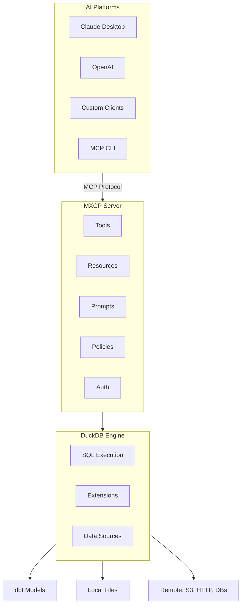

> **Related Topics:** [Quickstart](/getting-started/quickstart) (first setup) | [Configuration](/operations/configuration) (dbt, extensions) | [SQL Endpoints](/tutorials/sql-endpoints) (use DuckDB)

MXCP integrates with AI platforms, data transformation tools, and database systems to create production-ready AI applications.

## Integration Architecture



## Integrations

### [Claude Desktop](/integrations/claude-desktop)
Native MCP integration with Claude Desktop:
- Zero-code connection
- Stdio transport
- Multi-server support
- Developer console access

### [dbt](/integrations/dbt)
Data transformation and quality layer:
- Model preparation for AI
- Data quality testing
- Performance optimization
- Documentation generation

### [DuckDB](/integrations/duckdb)
Powerful SQL execution engine:
- Extension ecosystem
- Multi-source connectivity
- Secret management
- Performance tuning

## OpenAI Integration

Connect MXCP with OpenAI's API for custom integrations.

### Configuration

```python
import openai
import subprocess
import json

# Start MXCP server
mxcp_process = subprocess.Popen(
    ["mxcp", "serve", "--transport", "stdio"],
    stdin=subprocess.PIPE,
    stdout=subprocess.PIPE,
    text=True,
    cwd="/path/to/project"
)

# Get available tools from MXCP
def get_mxcp_tools():
    request = {"jsonrpc": "2.0", "id": 1, "method": "tools/list", "params": {}}
    mxcp_process.stdin.write(json.dumps(request) + "\n")
    mxcp_process.stdin.flush()
    response = json.loads(mxcp_process.stdout.readline())
    return response.get("result", {}).get("tools", [])

# Convert MXCP tools to OpenAI format
def mxcp_to_openai_tools(mxcp_tools):
    openai_tools = []
    for tool in mxcp_tools:
        openai_tools.append({
            "type": "function",
            "function": {
                "name": tool["name"],
                "description": tool.get("description", ""),
                "parameters": tool.get("inputSchema", {})
            }
        })
    return openai_tools

# Call MXCP tool
def call_mxcp_tool(name, arguments):
    request = {
        "jsonrpc": "2.0",
        "id": 2,
        "method": "tools/call",
        "params": {"name": name, "arguments": arguments}
    }
    mxcp_process.stdin.write(json.dumps(request) + "\n")
    mxcp_process.stdin.flush()
    response = json.loads(mxcp_process.stdout.readline())
    return response.get("result", {}).get("content", [])
```

### Usage with OpenAI

```python
client = openai.OpenAI()

# Get tools from MXCP
mxcp_tools = get_mxcp_tools()
openai_tools = mxcp_to_openai_tools(mxcp_tools)

# Create chat completion with tools
response = client.chat.completions.create(
    model="gpt-4",
    messages=[{"role": "user", "content": "Get user with ID 123"}],
    tools=openai_tools,
    tool_choice="auto"
)

# Handle tool calls
if response.choices[0].message.tool_calls:
    for tool_call in response.choices[0].message.tool_calls:
        result = call_mxcp_tool(
            tool_call.function.name,
            json.loads(tool_call.function.arguments)
        )
        print(f"Tool result: {result}")
```

### HTTP Integration

For HTTP transport:

```python
import requests

MXCP_URL = "http://localhost:8000"

def call_mxcp_http(tool_name, arguments):
    response = requests.post(
        f"{MXCP_URL}/tools/call",
        json={"name": tool_name, "arguments": arguments}
    )
    return response.json()

# Use with OpenAI function calling
result = call_mxcp_http("get_user", {"user_id": 123})
```

## Built-in SQL Tools

MXCP provides optional SQL exploration tools that let AI clients query your data directly:

### Available Tools

| Tool | Description |
|------|-------------|
| `execute_sql_query` | Run custom SQL queries |
| `list_tables` | See all available tables |
| `get_table_schema` | Inspect table structure |

### Enable SQL Tools

By default, SQL tools are disabled. Enable them in your configuration:

```yaml
# mxcp-site.yml
sql_tools:
  enabled: true
```

### Usage Examples

```bash
# With mcp-cli
mcp-cli tools call list_tables
mcp-cli tools call execute_sql_query --sql "SELECT COUNT(*) FROM users"
mcp-cli tools call get_table_schema --table_name "orders"
```

AI clients can use these tools to:
- Explore available data
- Run ad-hoc queries
- Inspect table structures

**Security Note:** Enable SQL tools only when appropriate. Consider using policies to restrict access.

## Quick Start

### Connect to Claude Desktop

1. **Start MXCP Server**:
   ```bash
   cd your-project
   mxcp serve --transport stdio
   ```

2. **Configure Claude Desktop**:
   ```json
   {
     "mcpServers": {
       "my-project": {
         "command": "mxcp",
         "args": ["serve", "--transport", "stdio"],
         "cwd": "/path/to/your-project"
       }
     }
   }
   ```

3. **Restart Claude Desktop** and start using your tools.

### Use dbt for Data Preparation

1. **Enable dbt**:
   ```yaml
   # mxcp-site.yml
   dbt:
     enabled: true
   ```

2. **Generate Config**:
   ```bash
   mxcp dbt-config
   ```

3. **Run Models**:
   ```bash
   mxcp dbt run
   ```

### Access External Data with DuckDB

1. **Enable Extensions**:
   ```yaml
   # mxcp-site.yml
   extensions:
     - httpfs
     - postgres
   ```

2. **Query Remote Data**:
   ```sql
   SELECT * FROM read_parquet('s3://bucket/data.parquet');
   ```

## Transport Modes

MXCP supports multiple transport protocols:

### stdio (Default)
Direct process communication:
```bash
mxcp serve --transport stdio
```

Best for:
- Claude Desktop
- Local development
- Process-based clients

### Streamable HTTP
HTTP with server-sent events for streaming:
```bash
mxcp serve --transport streamable-http --port 8000
```

Best for:
- Web applications
- Custom integrations
- Streaming responses

### SSE (Server-Sent Events) - Deprecated
Legacy SSE transport (deprecated in MCP protocol version 2025-03-26):
```bash
mxcp serve --transport sse --port 8000
```

Use only for:
- Backwards compatibility with older MCP clients
- Prefer `streamable-http` for new integrations

### Additional Options

```bash
# Enable/disable built-in SQL tools
mxcp serve --sql-tools true

# Read-only database mode
mxcp serve --readonly

# Stateless mode for serverless deployments
mxcp serve --stateless
```

## Custom Integrations

### Direct MCP Protocol

For custom clients, implement the MCP protocol:

```python
import subprocess
import json

# Start MXCP server
process = subprocess.Popen(
    ["mxcp", "serve", "--transport", "stdio"],
    stdin=subprocess.PIPE,
    stdout=subprocess.PIPE,
    text=True,
    cwd="/path/to/project"
)

# Send MCP request
request = {
    "jsonrpc": "2.0",
    "id": 1,
    "method": "tools/list",
    "params": {}
}

process.stdin.write(json.dumps(request) + "\n")
process.stdin.flush()

# Read response
response = json.loads(process.stdout.readline())
print(response)
```

### HTTP API

For HTTP mode, use standard REST calls:

```python
import requests

# List tools
tools = requests.get("http://localhost:8000/tools").json()

# Call a tool
result = requests.post(
    "http://localhost:8000/tools/call",
    json={
        "name": "get_user",
        "arguments": {"user_id": 123}
    }
).json()
```

### mcp-cli

Use the MCP command-line tool:

```bash
# Install
pip install mcp-cli

# Configure
cat > server_config.json << 'EOF'
{
  "mcpServers": {
    "local": {
      "command": "mxcp",
      "args": ["serve", "--transport", "stdio"],
      "cwd": "/path/to/project"
    }
  }
}
EOF

# List tools
mcp-cli tools list

# Call tool
mcp-cli tools call get_user --user_id 123
```

## Debugging Integrations

### Enable Debug Logging

```bash
# Environment variable
export MXCP_DEBUG=true

# CLI flag
mxcp serve --debug
```

### Check Server Status

```bash
# List endpoints
mxcp list

# Validate configuration
mxcp validate

# Run tests
mxcp test
```

### Claude Desktop Logs

Access Claude Desktop's developer console to see:
- Connection status
- Request/response logs
- Error messages

## Next Steps

- [Claude Desktop](/integrations/claude-desktop) - Detailed setup
- [dbt](/integrations/dbt) - Data transformation
- [DuckDB](/integrations/duckdb) - SQL engine and extensions
