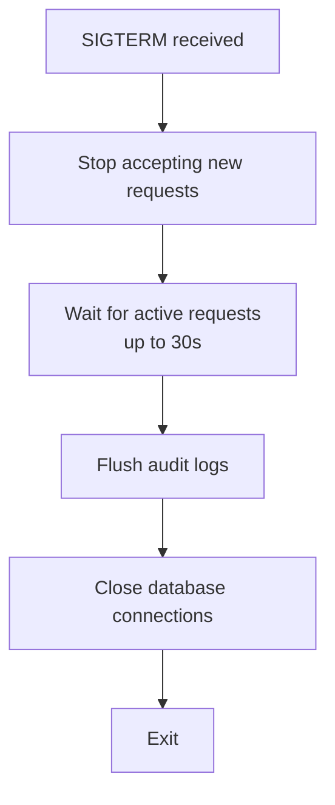
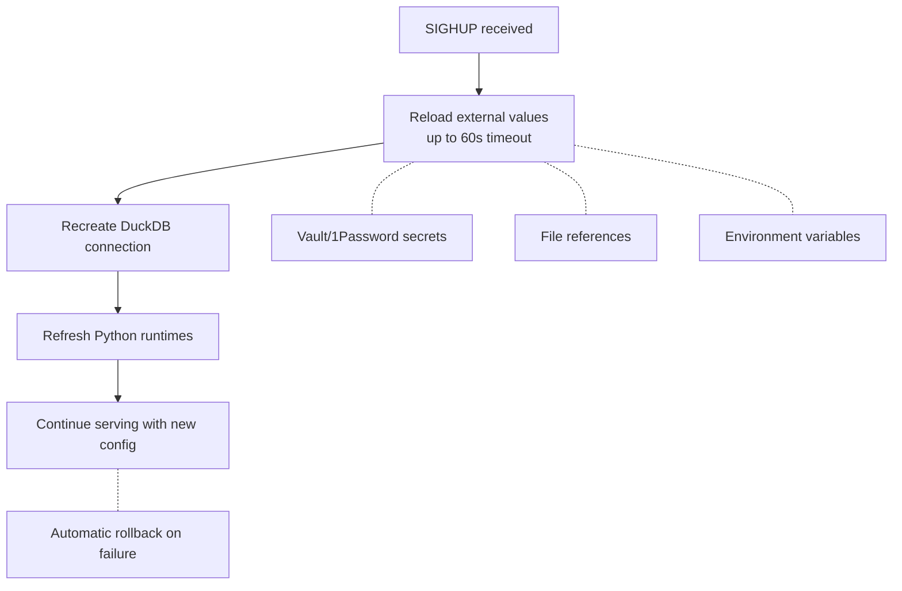

> **Related Topics:** [Configuration](/operations/configuration) (profiles, secrets) | [Monitoring](/operations/monitoring) (observability) | [Admin Socket](/operations/admin-socket) (health checks)

This guide covers deploying MXCP to production environments.

## Deployment Options

| Method | Best For | Complexity |
|--------|----------|------------|
| **stdio** | Claude Desktop, local development | None |
| **Docker** | Containerized environments, CI/CD | Low |
| **Docker Compose** | Multi-service setups, development | Low |
| **systemd** | Bare-metal Linux servers | Medium |
| **Kubernetes** | Orchestrated container platforms | High |

## Local Development (stdio)

For direct connection to Claude Desktop:

```bash
mxcp serve --transport stdio
```

Add to Claude Desktop config (`~/Library/Application Support/Claude/claude_desktop_config.json` on macOS):

```json
{
  "mcpServers": {
    "my-project": {
      "command": "mxcp",
      "args": ["serve", "--transport", "stdio"],
      "cwd": "/path/to/project"
    }
  }
}
```

## Multiple Environments

Run different profiles as separate instances:

```bash
# Production on port 8000
mxcp serve --profile production --port 8000

# Staging on port 8001
mxcp serve --profile staging --port 8001
```

Each MXCP instance:
- Serves one project's tools
- Uses one DuckDB file
- Runs as a single process
- Uses DuckDB's single-writer model (multiple instances need separate DuckDB files)

## Prerequisites

Before deploying, ensure you have:

1. **Project files ready:**
   - `mxcp-site.yml` with production profile configured
   - Endpoint definitions in `tools/`, `resources/`, `prompts/`
   - Python dependencies documented (if using Python endpoints)

2. **Secrets configured:**
   - User config (`~/.mxcp/config.yml`) or environment variables
   - Vault/1Password tokens (if using secret managers)

3. **Infrastructure prepared:**
   - Persistent storage for DuckDB (if not read-only)
   - Network access to required services (databases, APIs)

4. **Validation passed:**
   ```bash
   mxcp validate
   mxcp test
   ```

## Production Checklist

### Pre-Deployment

- [ ] All endpoints validated: `mxcp validate`
- [ ] All tests passing: `mxcp test`
- [ ] Security policies defined
- [ ] Secrets in secure storage (not in code)
- [ ] Backup procedures documented

### Deployment

- [ ] Use specific image tags (not `:latest`)
- [ ] Configure resource limits (memory, CPU)
- [ ] Set up health checks (admin socket)
- [ ] Enable audit logging
- [ ] Set up log rotation
- [ ] Configure TLS/SSL

### Post-Deployment

- [ ] Verify health checks passing
- [ ] Test authentication flow
- [ ] Verify audit logging working
- [ ] Test each endpoint
- [ ] Set up monitoring alerts
- [ ] Document operational procedures

### Ongoing Operations

- [ ] Monitor disk space (logs, database)
- [ ] Review audit logs regularly
- [ ] Rotate credentials periodically
- [ ] Update dependencies monthly
- [ ] Test backup restoration quarterly
- [ ] Monitor for drift: `mxcp drift-check`

## Resource Requirements

| Workload | Memory | CPU | Storage |
|----------|--------|-----|---------|
| Minimal | 256MB | 0.25 cores | 100MB |
| Typical | 512MB-1GB | 0.5-1 core | 1GB |
| Heavy queries | 2-4GB | 2-4 cores | 10GB+ |

DuckDB memory usage scales with query complexity. For large analytical queries, allocate more memory.

## Docker Deployment

### Official MXCP Image

The recommended approach for Docker deployments is to use the official MXCP base image from GitHub Container Registry:

```
ghcr.io/raw-labs/mxcp:latest
```

**What's included:**

| Component | Details |
|-----------|---------|
| Base | Python 3.11 slim |
| MXCP | Pre-installed with Vault and 1Password integrations |
| User | Non-root `mxcp` user (UID 1000) |
| Tools | curl for health checks |
| Admin socket | Enabled by default at `/run/mxcp/mxcp.sock` |
| Security | Vulnerability-scanned, minimal attack surface |

**Available tags:**

- `latest` - Latest stable release
- `0.10.0`, `0.9.0`, etc. - Specific stable versions
- `0.10.0-rc12`, etc. - Pre-release versions

### Using the Official Image (Recommended)

**Option 1: Mount your MXCP site (development)**

```bash
docker run -d \
  --name mxcp \
  -p 8000:8000 \
  -v $(pwd)/my-mxcp-site:/mxcp-site:ro \
  -v mxcp-data:/mxcp-site/data \
  -v mxcp-audit:/mxcp-site/audit \
  ghcr.io/raw-labs/mxcp:latest
```

**Option 2: Extend the image (production)**

```dockerfile
FROM ghcr.io/raw-labs/mxcp:latest

# Copy your MXCP site
COPY --chown=mxcp:mxcp . /mxcp-site/

# Install additional Python dependencies (optional)
COPY --chown=mxcp:mxcp requirements.txt /tmp/
RUN /mxcp-site/.venv/bin/pip install -r /tmp/requirements.txt && \
    rm /tmp/requirements.txt
```

Build and run:

```bash
docker build -t my-mxcp-app .
docker run -p 8000:8000 my-mxcp-app
```

**Directory structure in the official image:**

```
/mxcp-site/              # Working directory (mount your site here)
├── mxcp-site.yml        # MXCP site configuration
├── mxcp-config.yml      # User configuration (optional)
├── tools/               # Tool definitions
├── resources/           # Resource definitions
├── prompts/             # Prompt definitions
├── python/              # Python endpoints
├── sql/                 # SQL files
├── data/                # DuckDB databases (writable)
├── audit/               # Audit logs (writable)
└── drift/               # Drift snapshots (writable)

/run/mxcp/mxcp.sock      # Admin socket for health checks
```

### Building Your Own Image

If you need a custom base image, you can build from scratch:

### Basic Dockerfile

```dockerfile
FROM python:3.11-slim

WORKDIR /app

# Install MXCP and curl for healthchecks
RUN apt-get update && apt-get install -y --no-install-recommends curl \
    && rm -rf /var/lib/apt/lists/* \
    && pip install --no-cache-dir mxcp

# Copy project files
COPY mxcp-site.yml .
COPY tools/ tools/
COPY resources/ resources/
COPY prompts/ prompts/
COPY sql/ sql/
COPY python/ python/

# Create directories
RUN mkdir -p /data /var/log/mxcp /run/mxcp

# Set environment
ENV MXCP_PROFILE=production
ENV PYTHONUNBUFFERED=1

# Expose port
EXPOSE 8000

# Run server
CMD ["mxcp", "serve", "--port", "8000"]
```

**Note:** The server binds to the host configured in user config (`transport.http.host`). To bind to all interfaces, set `host: "0.0.0.0"` in your user config or mount a config file. Health checks require the admin socket - see [Docker with Admin Socket](#docker-with-admin-socket).

### Production Dockerfile (Multi-Stage)

```dockerfile
# Build stage
FROM python:3.11-slim AS builder

WORKDIR /build
RUN pip install --no-cache-dir mxcp

# Runtime stage
FROM python:3.11-slim

WORKDIR /app

# Install curl for healthchecks
RUN apt-get update && apt-get install -y --no-install-recommends curl \
    && rm -rf /var/lib/apt/lists/*

# Copy Python packages from builder
COPY --from=builder /usr/local/lib/python3.11/site-packages /usr/local/lib/python3.11/site-packages
COPY --from=builder /usr/local/bin/mxcp /usr/local/bin/mxcp

# Copy project files
COPY mxcp-site.yml .
COPY tools/ tools/
COPY sql/ sql/
COPY python/ python/

# Create non-root user
RUN useradd -m -u 1000 mxcp \
    && mkdir -p /data /var/log/mxcp /run/mxcp \
    && chown -R mxcp:mxcp /app /data /var/log/mxcp /run/mxcp

USER mxcp

ENV MXCP_PROFILE=production

EXPOSE 8000

CMD ["mxcp", "serve", "--port", "8000"]
```

### Docker with Admin Socket

To enable health checks, you must enable the admin socket:

```dockerfile
FROM python:3.11-slim

WORKDIR /app

# Install MXCP and curl for healthchecks
RUN apt-get update && apt-get install -y --no-install-recommends curl \
    && rm -rf /var/lib/apt/lists/* \
    && pip install --no-cache-dir mxcp

COPY mxcp-site.yml .
COPY tools/ tools/
COPY sql/ sql/
COPY python/ python/

RUN mkdir -p /data /var/log/mxcp /run/mxcp

ENV MXCP_PROFILE=production
ENV MXCP_ADMIN_ENABLED=true
ENV MXCP_ADMIN_SOCKET=/run/mxcp/mxcp.sock
ENV PYTHONUNBUFFERED=1

EXPOSE 8000

# Health check via admin socket
HEALTHCHECK --interval=30s --timeout=10s --start-period=10s --retries=3 \
    CMD curl -sf --unix-socket /run/mxcp/mxcp.sock http://localhost/health || exit 1

CMD ["mxcp", "serve", "--port", "8000"]
```

### Configuring Host Binding

MXCP binds to `localhost` by default. For Docker containers, you need to bind to all interfaces (`0.0.0.0`). Create a user config file:

```yaml title="config/config.yml"
mxcp: 1

transport:
  http:
    host: "0.0.0.0"
    port: 8000
```

Mount it in your container:

```bash
docker run -v ./config:/config -e MXCP_CONFIG=/config/config.yml mxcp:latest
```

Or in Docker Compose:

```yaml
volumes:
  - ./config:/config:ro
environment:
  - MXCP_CONFIG=/config/config.yml
```

### Volume Mounts

Essential volumes for Docker deployment:

```bash
# Project files (read-only)
-v /path/to/project:/app:ro

# User configuration (read-only, contains host binding)
-v /path/to/config:/config:ro

# Persistent data (read-write)
-v mxcp-data:/data
-v mxcp-audit:/var/log/mxcp
-v mxcp-drift:/app/drift
```

### Docker Compose

```yaml
version: '3.8'

services:
  mxcp:
    build: .
    ports:
      - "8000:8000"
    volumes:
      - ./data:/data
      - ./audit:/var/log/mxcp
      - mxcp-socket:/run/mxcp
    environment:
      - MXCP_PROFILE=production
      - MXCP_DUCKDB_PATH=/data/mxcp.duckdb
      - MXCP_ADMIN_ENABLED=true
      - MXCP_ADMIN_SOCKET=/run/mxcp/mxcp.sock
      - VAULT_TOKEN=${VAULT_TOKEN}
    restart: unless-stopped
    deploy:
      resources:
        limits:
          memory: 2G
          cpus: '1.0'

  # Optional: nginx reverse proxy
  nginx:
    image: nginx:alpine
    ports:
      - "443:443"
    volumes:
      - ./nginx.conf:/etc/nginx/nginx.conf:ro
      - ./certs:/etc/nginx/certs:ro
    depends_on:
      - mxcp

volumes:
  mxcp-socket:
```

### Docker Compose with Admin Sidecar

For environments where you need admin socket access from outside the container:

```yaml
version: '3.8'

services:
  mxcp:
    build: .
    ports:
      - "8000:8000"
    volumes:
      - mxcp-socket:/run/mxcp
      - ./data:/data
    environment:
      - MXCP_ADMIN_ENABLED=true
      - MXCP_ADMIN_SOCKET=/run/mxcp/mxcp.sock

  # Sidecar for admin operations
  admin:
    image: curlimages/curl
    volumes:
      - mxcp-socket:/run/mxcp:ro
    entrypoint: ["sh", "-c", "while true; do sleep 3600; done"]
    # Execute admin commands:
    # docker compose exec admin curl --unix-socket /run/mxcp/mxcp.sock http://localhost/health

volumes:
  mxcp-socket:
```

## systemd Service

### Service File

Create `/etc/systemd/system/mxcp.service`:

```ini
[Unit]
Description=MXCP MCP Server
After=network.target
Documentation=https://mxcp.dev/docs

[Service]
Type=simple
User=mxcp
Group=mxcp
WorkingDirectory=/opt/mxcp

# Environment
Environment="MXCP_PROFILE=production"
Environment="MXCP_ADMIN_ENABLED=true"
EnvironmentFile=-/etc/mxcp/environment

# Process management
ExecStart=/usr/local/bin/mxcp serve --port 8000
ExecReload=/bin/kill -HUP $MAINPID

# Security hardening
NoNewPrivileges=true
ProtectSystem=strict
ProtectHome=true
ReadWritePaths=/data /var/log/mxcp /run/mxcp

# Resource limits
MemoryMax=2G
CPUQuota=200%

# Restart behavior
Restart=on-failure
RestartSec=5
StartLimitInterval=60
StartLimitBurst=3

[Install]
WantedBy=multi-user.target
```

### Environment File

Create `/etc/mxcp/environment`:

```bash
MXCP_PROFILE=production
MXCP_DUCKDB_PATH=/data/mxcp.duckdb
MXCP_CONFIG=/etc/mxcp/config.yml
VAULT_TOKEN=hvs.your-vault-token
ANTHROPIC_API_KEY=your-api-key
```

### User Configuration

Create `/etc/mxcp/config.yml` to configure host binding:

```yaml
mxcp: 1

transport:
  http:
    host: "0.0.0.0"  # Bind to all interfaces
    port: 8000
```

Set permissions: `chmod 600 /etc/mxcp/config.yml`

### Service Management

```bash
# Reload systemd configuration
sudo systemctl daemon-reload

# Enable service to start on boot
sudo systemctl enable mxcp

# Start service
sudo systemctl start mxcp

# Check status
sudo systemctl status mxcp

# View logs
sudo journalctl -u mxcp -f

# Hot reload configuration (sends SIGHUP)
sudo systemctl reload mxcp
```

### Audit Cleanup Timer

Automatically clean old audit logs with a systemd timer.

Create `/etc/systemd/system/mxcp-log-cleanup.service`:

```ini
[Unit]
Description=MXCP Audit Log Cleanup
After=network.target

[Service]
Type=oneshot
User=mxcp
Group=mxcp
WorkingDirectory=/opt/mxcp
ExecStart=/usr/local/bin/mxcp log-cleanup --retention-days 90

# Security hardening
NoNewPrivileges=true
ProtectSystem=strict
ReadWritePaths=/var/log/mxcp
```

Create `/etc/systemd/system/mxcp-log-cleanup.timer`:

```ini
[Unit]
Description=Run MXCP Audit Cleanup daily at 2 AM
Requires=mxcp-log-cleanup.service

[Timer]
OnCalendar=daily
AccuracySec=1h
Persistent=true
RandomizedDelaySec=30min

[Install]
WantedBy=timers.target
```

Enable the timer:

```bash
sudo systemctl enable mxcp-log-cleanup.timer
sudo systemctl start mxcp-log-cleanup.timer
```

### Multiple Profiles with systemd

Run different profiles as separate services:

```bash
# Copy and customize for each profile
sudo cp /etc/systemd/system/mxcp.service /etc/systemd/system/mxcp-prod.service
sudo cp /etc/systemd/system/mxcp.service /etc/systemd/system/mxcp-staging.service
```

Edit each service file:

```ini
# mxcp-prod.service
ExecStart=/usr/local/bin/mxcp serve --profile production --port 8000

# mxcp-staging.service
ExecStart=/usr/local/bin/mxcp serve --profile staging --port 8001
```

## Signal Handling

MXCP handles Unix signals for graceful operations:

| Signal | Action | Use Case |
|--------|--------|----------|
| `SIGTERM` | Graceful shutdown | Normal stop, container termination |
| `SIGHUP` | Hot reload | Refresh secrets, reconnect DB |
| `SIGINT` | Immediate shutdown | Development, Ctrl+C |

### SIGTERM - Graceful Shutdown



### SIGHUP - Hot Reload



**What reloads:**
- Vault/1Password secrets
- File references (`file://`)
- Environment variables
- DuckDB connections
- Python runtime configs

**What does NOT reload:**
- Configuration file structure
- OAuth settings
- Server host/port
- Endpoint definitions

## Kubernetes Deployment

### Deployment

```yaml
apiVersion: apps/v1
kind: Deployment
metadata:
  name: mxcp
  labels:
    app: mxcp
spec:
  replicas: 1  # See Scaling Considerations
  selector:
    matchLabels:
      app: mxcp
  template:
    metadata:
      labels:
        app: mxcp
    spec:
      containers:
        - name: mxcp
          image: your-registry/mxcp:latest
          ports:
            - containerPort: 8000
          env:
            - name: MXCP_PROFILE
              value: production
            - name: MXCP_ADMIN_ENABLED
              value: "true"
            - name: MXCP_ADMIN_SOCKET
              value: /run/mxcp/mxcp.sock
            - name: VAULT_TOKEN
              valueFrom:
                secretKeyRef:
                  name: mxcp-secrets
                  key: vault-token
          volumeMounts:
            - name: data
              mountPath: /data
            - name: admin-socket
              mountPath: /run/mxcp
          resources:
            requests:
              memory: "512Mi"
              cpu: "250m"
            limits:
              memory: "2Gi"
              cpu: "1000m"
          livenessProbe:
            exec:
              command:
                - curl
                - -sf
                - --unix-socket
                - /run/mxcp/mxcp.sock
                - http://localhost/health
            initialDelaySeconds: 10
            periodSeconds: 10
            timeoutSeconds: 5
          readinessProbe:
            exec:
              command:
                - curl
                - -sf
                - --unix-socket
                - /run/mxcp/mxcp.sock
                - http://localhost/health
            initialDelaySeconds: 5
            periodSeconds: 5
            timeoutSeconds: 3
      volumes:
        - name: data
          persistentVolumeClaim:
            claimName: mxcp-data
        - name: admin-socket
          emptyDir: {}
```

### Service

```yaml
apiVersion: v1
kind: Service
metadata:
  name: mxcp
spec:
  selector:
    app: mxcp
  ports:
    - port: 80
      targetPort: 8000
  type: ClusterIP
```

### Ingress

```yaml
apiVersion: networking.k8s.io/v1
kind: Ingress
metadata:
  name: mxcp
  annotations:
    nginx.ingress.kubernetes.io/ssl-redirect: "true"
    nginx.ingress.kubernetes.io/proxy-read-timeout: "300"
spec:
  tls:
    - hosts:
        - mxcp.example.com
      secretName: mxcp-tls
  rules:
    - host: mxcp.example.com
      http:
        paths:
          - path: /
            pathType: Prefix
            backend:
              service:
                name: mxcp
                port:
                  number: 80
```

### ConfigMap for Site Configuration

```yaml
apiVersion: v1
kind: ConfigMap
metadata:
  name: mxcp-site-config
data:
  mxcp-site.yml: |
    mxcp: 1
    project: my-project
    profile: production

    profiles:
      production:
        duckdb:
          path: /data/mxcp.duckdb
          readonly: false
        audit:
          enabled: true
          path: /var/log/mxcp/audit.jsonl
```

## Stateless Mode

For environments without persistent connections (load balancers, some proxies), use stateless mode:

```bash
mxcp serve --stateless --port 8000
```

### Configuration

```yaml
# mxcp-site.yml
mxcp: 1
project: my-project
profile: stateless

profiles:
  stateless:
    duckdb:
      path: /tmp/mxcp.duckdb  # Ephemeral or shared storage
      readonly: true           # Recommended for stateless
```

### When to Use Stateless Mode

- **Load balancers** that don't support sticky sessions
- **Horizontal scaling** with multiple instances
- **Serverless-like environments** where instances are ephemeral

### Stateless Considerations

- **No session state**: Each request is independent
- **Read-only recommended**: Use external databases for writes
- **Shared storage**: If using DuckDB, ensure all instances can access the same file (NFS, EFS)

## Reverse Proxy Configuration

### nginx

```nginx
upstream mxcp {
    server localhost:8000;
    keepalive 32;
}

server {
    listen 443 ssl http2;
    server_name mxcp.example.com;

    ssl_certificate /etc/nginx/certs/cert.pem;
    ssl_certificate_key /etc/nginx/certs/key.pem;

    location / {
        proxy_pass http://mxcp;
        proxy_http_version 1.1;
        proxy_set_header Host $host;
        proxy_set_header X-Real-IP $remote_addr;
        proxy_set_header X-Forwarded-For $proxy_add_x_forwarded_for;
        proxy_set_header X-Forwarded-Proto $scheme;
        proxy_set_header Upgrade $http_upgrade;
        proxy_set_header Connection "upgrade";

        # Timeouts for long-running requests
        proxy_read_timeout 300s;
        proxy_send_timeout 300s;
    }
}
```

### Traefik

```yaml
http:
  routers:
    mxcp:
      rule: "Host(`mxcp.example.com`)"
      service: mxcp
      tls:
        certResolver: letsencrypt
      middlewares:
        - headers

  services:
    mxcp:
      loadBalancer:
        servers:
          - url: "http://localhost:8000"

  middlewares:
    headers:
      headers:
        stsSeconds: 31536000
        stsIncludeSubdomains: true
```

**Note:** Health checks require the admin socket. External load balancers should use TCP health checks on port 8000, or configure a sidecar to expose the admin socket health endpoint.

## Admin Socket Health Checks

For detailed health monitoring, use the admin socket:

```bash
# Enable admin socket
export MXCP_ADMIN_ENABLED=true
export MXCP_ADMIN_SOCKET=/run/mxcp/mxcp.sock

# Basic health check
curl --unix-socket /run/mxcp/mxcp.sock http://localhost/health
# Response: {"status": "healthy"}

# Detailed status
curl --unix-socket /run/mxcp/mxcp.sock http://localhost/status
# Response: {"status": "healthy", "uptime": 3600, "requests": 1000, ...}
```

See [Admin Socket](/operations/admin-socket) for complete API reference.

## Scaling Considerations

### Single Instance (Recommended)

- Simplest deployment
- DuckDB works best with single writer
- Suitable for most use cases
- Use vertical scaling (more CPU/memory) for higher throughput

### Read Replicas

For read-heavy workloads with a shared DuckDB file:

```yaml
# Writer instance
mxcp:
  replicas: 1
  env:
    MXCP_READONLY: "false"
  volumes:
    - type: nfs
      source: mxcp-data
      target: /data

# Reader instances
mxcp-reader:
  replicas: 3
  env:
    MXCP_READONLY: "true"
  volumes:
    - type: nfs
      source: mxcp-data
      target: /data
      read_only: true
```

**Requirements:**
- Shared filesystem (NFS, EFS, GlusterFS)
- Single writer, multiple readers
- Readers use `--readonly` flag

### Horizontal Scaling with External Database

For true horizontal scaling, use external databases instead of DuckDB file:

- PostgreSQL via `postgres_scanner` extension
- MySQL via `mysql_scanner` extension
- Cloud data warehouses (Snowflake, BigQuery)

## Backup Strategy

### Database Backup

```bash
# Option 1: File copy (requires brief stop or read-only mode)
mxcp serve --readonly &
cp /data/mxcp.duckdb /backup/mxcp-$(date +%Y%m%d).duckdb

# Option 2: DuckDB export (online, but slower)
duckdb /data/mxcp.duckdb <<EOF
COPY (SELECT * FROM my_table) TO '/backup/my_table.parquet';
EOF

# Option 3: Scheduled backup script
#!/bin/bash
BACKUP_DIR=/backup/$(date +%Y%m%d)
mkdir -p $BACKUP_DIR

# Trigger checkpoint for consistency
curl --unix-socket /run/mxcp/mxcp.sock -X POST http://localhost/admin/checkpoint

# Copy database
cp /data/mxcp.duckdb $BACKUP_DIR/

# Compress
gzip $BACKUP_DIR/mxcp.duckdb
```

### Audit Log Backup

```bash
# Archive and rotate
tar -czf /backup/audit-$(date +%Y%m%d).tar.gz /var/log/mxcp/
find /var/log/mxcp -name "*.jsonl" -mtime +30 -delete

# Sync to object storage
aws s3 sync /var/log/mxcp/ s3://backups/mxcp/audit/

# Use mxcp log-cleanup for managed rotation
mxcp log-cleanup --retention-days 90
```

### Backup Schedule Recommendations

| Data | Frequency | Retention |
|------|-----------|-----------|
| DuckDB database | Daily | 30 days |
| Audit logs | Daily archive | 90 days local, 1 year cloud |
| Configuration | On change | Versioned in git |

### Recovery Procedure

```bash
# Stop service
sudo systemctl stop mxcp

# Restore database
cp /backup/mxcp-20240115.duckdb /data/mxcp.duckdb
chown mxcp:mxcp /data/mxcp.duckdb

# Start service
sudo systemctl start mxcp

# Verify health
curl --unix-socket /run/mxcp/mxcp.sock http://localhost/health
```

## Security Hardening

### File Permissions

```bash
# Database - readable/writable by mxcp user only
chmod 640 /data/mxcp.duckdb
chown mxcp:mxcp /data/mxcp.duckdb

# Audit logs
chmod 640 /var/log/mxcp/*.jsonl
chown mxcp:mxcp /var/log/mxcp/*.jsonl

# User configuration (contains secrets)
chmod 600 ~/.mxcp/config.yml

# Admin socket
chmod 660 /run/mxcp/mxcp.sock
chown mxcp:mxcp /run/mxcp/mxcp.sock
```

### Network Restrictions

```bash
# Allow only internal network
iptables -A INPUT -p tcp --dport 8000 -s 10.0.0.0/8 -j ACCEPT
iptables -A INPUT -p tcp --dport 8000 -j DROP

# Or use firewalld
firewall-cmd --add-rich-rule='rule family="ipv4" source address="10.0.0.0/8" port port="8000" protocol="tcp" accept'
```

### Container Security

```yaml
# Kubernetes SecurityContext
securityContext:
  runAsNonRoot: true
  runAsUser: 1000
  readOnlyRootFilesystem: true
  allowPrivilegeEscalation: false
  capabilities:
    drop:
      - ALL
```

### Security Scanning

Scan container images for vulnerabilities:

```bash
# Using Trivy
trivy image your-registry/mxcp:latest

# Using Docker Scout
docker scout cves your-registry/mxcp:latest
```

## Environment Variables Reference

Key environment variables for deployment:

| Variable | Description | Default |
|----------|-------------|---------|
| `MXCP_PROFILE` | Active profile | `default` |
| `MXCP_CONFIG` | User config path | `~/.mxcp/config.yml` |
| `MXCP_DUCKDB_PATH` | Database path override | from config |
| `MXCP_READONLY` | Force read-only mode | `false` |
| `MXCP_ADMIN_ENABLED` | Enable admin socket | `false` |
| `MXCP_ADMIN_SOCKET` | Admin socket path | `/run/mxcp/mxcp.sock` |
| `MXCP_DEBUG` | Debug logging | `false` |
| `MXCP_AUDIT_ENABLED` | Override audit setting | from config |

See [Configuration](/operations/configuration#environment-variables) for complete list.

## Troubleshooting

### Service Won't Start

```bash
# Check logs
journalctl -u mxcp -n 50

# Validate configuration
mxcp validate

# Check file permissions
ls -la /data /var/log/mxcp /opt/mxcp

# Test manually
sudo -u mxcp mxcp serve --port 8000
```

### Container Won't Start

```bash
# Check logs
docker logs mxcp

# Common issues:
# - Missing config files
# - Invalid YAML syntax
# - Missing environment variables
# - Permission issues

# Debug mode
docker run -it --rm \
  -v $(pwd):/app \
  mxcp:latest \
  mxcp validate --debug
```

### Authentication Failures

```bash
# Verify OAuth config
mxcp validate

# Check environment variables
docker exec mxcp env | grep CLIENT

# Verify redirect URIs match exactly in OAuth provider settings
```

### Database Locked

DuckDB only supports a single writer. If you see "database is locked" errors:

```bash
# Check for stale connections
lsof | grep production.duckdb

# Make sure you're not running multiple instances
# pointing to the same DuckDB file
pgrep -f mxcp
```

### High Memory Usage

- Check DuckDB query patterns with `EXPLAIN ANALYZE`
- Implement query result limits
- Monitor via admin socket `/status` endpoint
- Consider read-only mode with external aggregation

### Connection Refused

```bash
# Verify service is running
systemctl status mxcp

# Check port binding
ss -tlnp | grep 8000

# Test locally (admin socket must be enabled)
curl --unix-socket /run/mxcp/mxcp.sock http://localhost/health

# Check firewall
iptables -L -n | grep 8000
```

### Performance Issues

```bash
# Monitor resource usage
docker stats mxcp

# Check slow queries in audit logs
mxcp log --since 1h | jq 'select(.duration_ms > 1000)'

# Analyze patterns
mxcp log --export-duckdb perf.db
duckdb perf.db "SELECT name, AVG(duration_ms) FROM logs GROUP BY name ORDER BY 2 DESC;"
```

### Hot Reload Fails

```bash
# Check reload logs
journalctl -u mxcp | grep -i reload

# Verify secrets are accessible
mxcp validate

# Test vault/1password connectivity
vault kv get secret/myapp
op read "op://Private/item/field"
```

### Debug Mode

```bash
# Enable debug logging
mxcp serve --debug

# Or via environment
export MXCP_DEBUG=true
mxcp serve
```

## Next Steps

- [Monitoring](/operations/monitoring) - Set up observability
- [Admin Socket](/operations/admin-socket) - Health checks and management API
- [Auditing](/security/auditing) - Configure audit logging
- [Configuration](/operations/configuration) - Complete configuration reference
