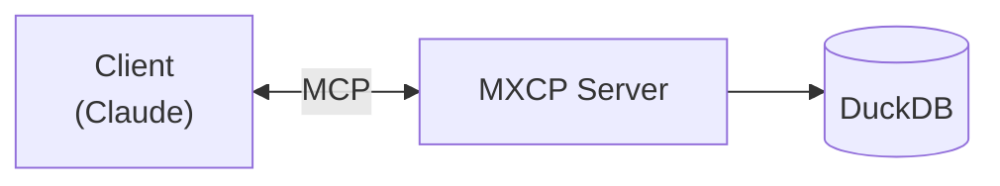
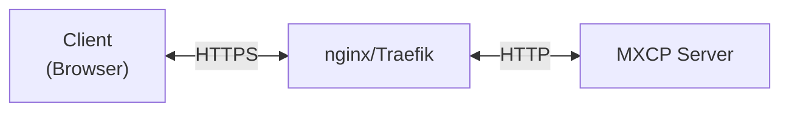
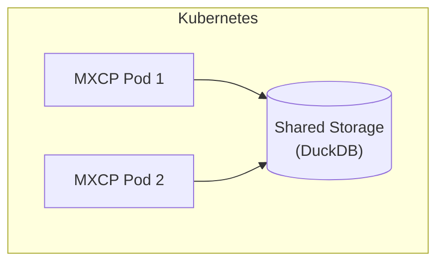

> **Related Topics:** [Security](/security/) (authentication, policies) | [Quality](/quality/) (testing, validation) | [Common Tasks](/reference/common-tasks#operations) (quick how-to)

This section covers everything you need to deploy and operate MXCP in production environments.

## Topics

### [Configuration](/operations/configuration)
Complete configuration reference:
- Site configuration (`mxcp-site.yml`)
- User configuration (`~/.mxcp/config.yml`)
- Environment variables
- Secret management (Vault, 1Password)

### [Deployment](/operations/deployment)
Production deployment patterns:
- Docker deployment
- systemd service configuration
- Kubernetes deployment
- Signal handling and hot reload

### [Monitoring](/operations/monitoring)
Observability and operational monitoring:
- OpenTelemetry integration
- Drift detection
- Admin API
- Health checks

## Quick Reference

### Start Server

```bash
# stdio transport (for Claude Desktop)
mxcp serve

# HTTP transport
mxcp serve --transport streamable-http --port 8000

# With specific profile
mxcp serve --profile production
```

### Environment Variables

| Variable | Description | Default |
|----------|-------------|---------|
| `MXCP_CONFIG` | User config path | `~/.mxcp/config.yml` |
| `MXCP_PROFILE` | Active profile | `default` |
| `MXCP_DEBUG` | Enable debug logging | `false` |
| `MXCP_READONLY` | Read-only database | `false` |
| `MXCP_DUCKDB_PATH` | Override DuckDB path | from config |
| `MXCP_ADMIN_ENABLED` | Enable admin API | `false` |
| `MXCP_ADMIN_SOCKET` | Admin socket path | `/run/mxcp/mxcp.sock` |

### Signal Handling

| Signal | Behavior |
|--------|----------|
| `SIGTERM` | Graceful shutdown |
| `SIGHUP` | Hot reload configuration |
| `SIGINT` | Immediate shutdown |

### CLI Commands

```bash
# List endpoints
mxcp list

# Validate endpoints
mxcp validate

# Run tests
mxcp test

# Query audit logs
mxcp log --since 1h

# Check drift
mxcp drift-check

# Create drift snapshot
mxcp drift-snapshot
```

## Deployment Checklist

Before deploying to production:

- [ ] **Security**
  - [ ] Authentication configured
  - [ ] Policies defined
  - [ ] Audit logging enabled
  - [ ] Secrets in Vault/1Password

- [ ] **Configuration**
  - [ ] Production profile created
  - [ ] Database path configured
  - [ ] Correct transport settings

- [ ] **Quality**
  - [ ] All tests passing
  - [ ] Validation successful
  - [ ] Linting issues addressed

- [ ] **Operations**
  - [ ] Monitoring configured
  - [ ] Log rotation set up
  - [ ] Backup strategy defined
  - [ ] Drift baseline created

## Architecture Patterns

### Single Instance



### Behind Reverse Proxy



### Container Deployment



## Common Operations

### Hot Reload Configuration

Reload secrets without restart:

```bash
# Using signal
kill -HUP $(pgrep -f "mxcp serve")

# Using admin API
curl --unix-socket /run/mxcp/mxcp.sock -X POST http://localhost/reload
```

### Check Server Status

```bash
# Via admin API
curl --unix-socket /run/mxcp/mxcp.sock http://localhost/status | jq

# Response includes:
# - version
# - uptime
# - profile
# - endpoint counts
# - reload status
```

### Database Maintenance

```bash
# Backup database
cp db.duckdb db.duckdb.backup

# Optimize database
duckdb db.duckdb "PRAGMA optimize"

# Check database size
du -h db.duckdb
```

## Next Steps

- [Configuration](/operations/configuration) - Complete configuration guide
- [Deployment](/operations/deployment) - Production deployment patterns
- [Monitoring](/operations/monitoring) - Observability setup
