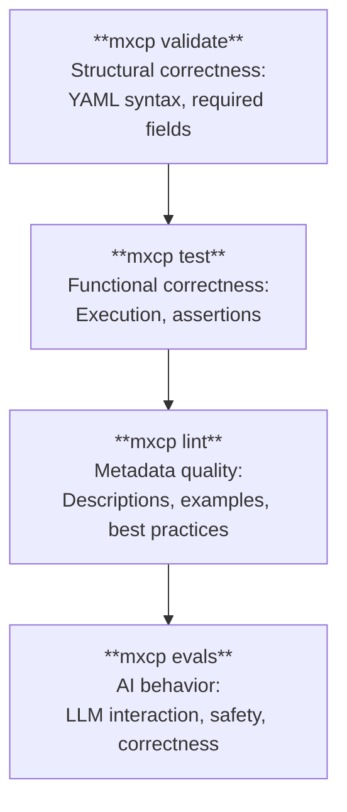

> **Related Topics:** [Quickstart](/getting-started/quickstart/) (getting started) | [CLI Reference](/reference/cli) (command options) | [Common Tasks](/reference/common-tasks#testing--quality) (quick how-to)

MXCP provides a comprehensive 4-layer quality framework to ensure your endpoints are production-ready. This section covers validation, testing, linting, and LLM evaluation.

## Quality Layers



## Quick Start

```bash
# Validate all endpoints
mxcp validate

# Run tests
mxcp test

# Check metadata quality
mxcp lint

# Run LLM evaluations
mxcp evals
```

## Topics

### [Validation](/quality/validation)
Verify endpoint structure and syntax:
- YAML correctness
- Required fields
- Type definitions
- File references

### [Testing](/quality/testing)
Test endpoint functionality:
- Test case definitions
- Assertion types
- Policy testing
- CI/CD integration

### [Linting](/quality/linting)
Improve AI comprehension:
- Description quality
- Example coverage
- Best practice checks
- Auto-suggestions

### [Evals](/quality/evals)
Test AI behavior:
- LLM tool usage
- Safety verification
- Permission testing
- Multi-model support

## Workflow Integration

### Development

```bash
# After creating/modifying an endpoint
mxcp validate  # Check structure
mxcp test      # Verify functionality
mxcp lint      # Improve metadata
```

### Pre-Commit

```bash
# Run all quality checks
mxcp validate && mxcp test && mxcp lint
```

### CI/CD Pipeline

```yaml
# .github/workflows/quality.yml
name: Quality Checks
on: [push, pull_request]

jobs:
  quality:
    runs-on: ubuntu-latest
    steps:
      - uses: actions/checkout@v4
      - uses: actions/setup-python@v5
        with:
          python-version: '3.11'
      - run: pip install mxcp
      - run: mxcp validate
      - run: mxcp test --json-output > test-results.json
      - run: mxcp lint --json-output > lint-results.json
```

### Pre-Production

```bash
# Before deployment
mxcp validate
mxcp test
mxcp lint
mxcp evals  # Test AI behavior
mxcp drift-snapshot  # Create baseline
```

## Best Practices

### 1. Validate Early
Run `mxcp validate` frequently during development.

### 2. Write Tests
Add tests to every endpoint definition.

### 3. Address Lint Issues
Fix warnings to improve AI understanding.

### 4. Test AI Behavior
Use evals for critical endpoints.

### 5. Automate
Include quality checks in CI/CD.

## Command Reference

### Validation

```bash
mxcp validate              # Validate all
mxcp validate --json-output # JSON output
```

### Testing

```bash
mxcp test                  # Run all tests
mxcp test tool my_tool     # Test specific tool
mxcp test resource my_res  # Test specific resource
mxcp test --json-output    # JSON output
```

### Linting

```bash
mxcp lint                  # Check all endpoints
mxcp lint --severity warning  # Show warnings only
mxcp lint --json-output    # JSON output
```

### Evals

```bash
mxcp evals                 # Run all evals
mxcp evals my_suite        # Run specific suite
mxcp evals --model gpt-4o  # Use specific model
```

## Next Steps

- [Validation](/quality/validation) - Structural checks
- [Testing](/quality/testing) - Functional testing
- [Linting](/quality/linting) - Metadata quality
- [Evals](/quality/evals) - AI behavior testing
