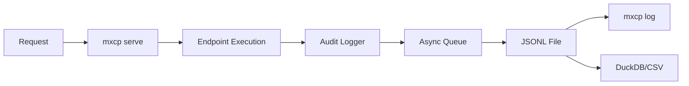

> **Related Topics:** [Configuration](/operations/configuration) (enable auditing) | [Monitoring](/operations/monitoring) (observability) | [Policies](/security/policies) (access control) | [Common Tasks](/reference/common-tasks#how-do-i-enable-audit-logging) (quick setup)

MXCP provides comprehensive audit logging to track all endpoint executions. Audit logs are essential for security, compliance, debugging, and understanding usage patterns.

## How It Works



The audit logger runs in a background thread with an async queue, ensuring zero impact on request latency.

## What Gets Logged

When enabled, MXCP logs every execution with:

| Field | Description | Example |
|-------|-------------|---------|
| `timestamp` | UTC timestamp | `2024-01-15T10:30:45.123Z` |
| `caller_type` | Request source | `http`, `stdio` (see below) |
| `operation_type` | Endpoint type | `tool`, `resource`, `prompt` |
| `operation_name` | Endpoint name | `get_user` |
| `input_data` | Parameters (redacted) | `{"user_id": 123}` |
| `duration_ms` | Execution time | `145` |
| `policy_decision` | Policy result | `allow`, `deny`, `n/a` |
| `policy_reason` | Policy reason | `"Admin access required"` |
| `operation_status` | Execution result | `success`, `error` |
| `error` | Error message | `"Connection timeout"` |
| `user_id` | Authenticated user | `"john@example.com"` |
| `session_id` | Session identifier | `"sess_abc123"` |

### Caller Types

The `caller_type` field indicates how the endpoint was invoked:
- **http**: HTTP API request (when running `mxcp serve` with default transport)
- **stdio**: Standard I/O protocol (when running `mxcp serve --transport stdio`)

**Note**: Audit logging only occurs through `mxcp serve`. Direct CLI execution via `mxcp run` does not generate audit logs.

## Configuration

Enable audit logging in `mxcp-site.yml`:

```yaml
profiles:
  default:
    audit:
      enabled: true
      path: audit/logs.jsonl

  production:
    audit:
      enabled: true
      path: /var/log/mxcp/audit.jsonl
```

The log file is created automatically when the first event is logged.

## Storage Format

Audit logs use **JSONL (JSON Lines)** format - one JSON object per line:

```json
{"timestamp":"2024-01-15T10:30:45.123Z","caller_type":"http","operation_type":"tool","operation_name":"get_user","input_data":{"user_id":123},"duration_ms":145,"policy_decision":"allow","operation_status":"success"}
{"timestamp":"2024-01-15T10:30:46.456Z","caller_type":"http","operation_type":"tool","operation_name":"update_user","input_data":{"user_id":123},"duration_ms":89,"policy_decision":"deny","policy_reason":"Admin required","operation_status":"error"}
```

JSONL advantages:
- Human-readable
- Streaming-friendly (can be tailed)
- Compatible with many analysis tools

## Querying Logs

Use `mxcp log` to query audit logs:

### Basic Queries

```bash
# Show recent logs
mxcp log

# Show last 50 entries
mxcp log --limit 50
```

### Filter by Time

```bash
# Last 10 minutes
mxcp log --since 10m

# Last 2 hours
mxcp log --since 2h

# Last day
mxcp log --since 1d
```

### Filter by Endpoint

```bash
# Specific tool
mxcp log --tool get_user

# All tools
mxcp log --type tool

# All resources
mxcp log --type resource
```

### Filter by Status

```bash
# Only errors
mxcp log --status error

# Only successful
mxcp log --status success
```

### Filter by Policy

```bash
# Denied requests
mxcp log --policy deny

# Allowed requests
mxcp log --policy allow

# No policy applied
mxcp log --policy n/a
```

### Combine Filters

```bash
# Errors in last hour
mxcp log --status error --since 1h

# Denied tool calls today
mxcp log --type tool --policy deny --since 1d

# Specific tool errors
mxcp log --tool get_user --status error
```

## Output Formats

### Table Format (Default)

```bash
mxcp log
```

```
TIMESTAMP                 TYPE   NAME       STATUS   POLICY  DURATION
2024-01-15T10:30:45.123Z  tool   get_user   success  allow   145ms
2024-01-15T10:30:46.456Z  tool   update     error    deny    89ms
```

### JSON Format

```bash
mxcp log --json
```

```json
[
  {
    "timestamp": "2024-01-15T10:30:45.123Z",
    "type": "tool",
    "name": "get_user",
    "status": "success",
    "policy_decision": "allow",
    "duration_ms": 145
  }
]
```

### Export to CSV

```bash
mxcp log --export-csv audit.csv
```

### Export to DuckDB

```bash
mxcp log --export-duckdb audit.db
```

## DuckDB Analysis

Export to DuckDB for complex SQL analysis:

```bash
mxcp log --export-duckdb audit.db
duckdb audit.db
```

### Example Queries

**Top 10 most used tools:**
```sql
SELECT operation_name, COUNT(*) as count
FROM logs
WHERE operation_type = 'tool'
GROUP BY operation_name
ORDER BY count DESC
LIMIT 10;
```

**Error rate by hour:**
```sql
SELECT
  DATE_TRUNC('hour', timestamp) as hour,
  COUNT(CASE WHEN operation_status = 'error' THEN 1 END) as errors,
  COUNT(*) as total,
  ROUND(100.0 * COUNT(CASE WHEN operation_status = 'error' THEN 1 END) / COUNT(*), 2) as error_rate
FROM logs
GROUP BY hour
ORDER BY hour DESC;
```

**Policy violations by endpoint:**
```sql
SELECT
  operation_name,
  COUNT(*) as denials,
  STRING_AGG(DISTINCT policy_reason, ', ') as reasons
FROM logs
WHERE policy_decision = 'deny'
GROUP BY operation_name
ORDER BY denials DESC;
```

**Average response time by tool:**
```sql
SELECT
  operation_name,
  AVG(duration_ms) as avg_ms,
  MIN(duration_ms) as min_ms,
  MAX(duration_ms) as max_ms,
  COUNT(*) as calls
FROM logs
WHERE operation_type = 'tool' AND operation_status = 'success'
GROUP BY operation_name
ORDER BY avg_ms DESC;
```

## Real-Time Monitoring

Monitor logs in real-time using standard Unix tools:

```bash
# Watch all logs
tail -f audit/logs.jsonl

# Watch for errors
tail -f audit/logs.jsonl | grep '"operation_status":"error"'

# Watch for policy denials
tail -f audit/logs.jsonl | grep '"policy_decision":"deny"'

# Pretty-print recent entries
tail -n 10 audit/logs.jsonl | jq .
```

## Sensitive Data Redaction

Fields marked as `sensitive: true` in your schema are automatically redacted:

**Schema:**
```yaml
parameters:
  - name: username
    type: string
    description: User's username
  - name: api_key
    type: string
    sensitive: true
    description: API key for authentication
  - name: config
    type: object
    properties:
      host:
        type: string
      password:
        type: string
        sensitive: true
```

**Audit log entry:**
```json
{
  "input_data": {
    "username": "john_doe",
    "api_key": "[REDACTED]",
    "config": {
      "host": "example.com",
      "password": "[REDACTED]"
    }
  }
}
```

Redaction applies to:
- Parameters marked sensitive
- Nested fields marked sensitive
- Any field containing `password`, `secret`, `token`, `key` (configurable)

**Important**: Only fields explicitly marked with `sensitive: true` in the endpoint schema will be redacted. If no schema is provided or fields are not marked as sensitive, they will appear in plain text in the audit logs.

## Log Rotation

For production environments, implement log rotation:

### Using logrotate (Linux)

Create `/etc/logrotate.d/mxcp`:

```
/var/log/mxcp/audit.jsonl {
    daily
    rotate 30
    compress
    delaycompress
    missingok
    notifempty
    create 0640 mxcp mxcp
    postrotate
        systemctl reload mxcp
    endscript
}
```

### Manual Rotation

```bash
# Archive current log
mv audit/logs.jsonl audit/logs-$(date +%Y%m%d).jsonl

# Compress archived logs
gzip audit/logs-*.jsonl

# MXCP creates new file automatically
```

## Integration with Log Analysis Tools

### Elasticsearch

```bash
# Import JSONL to Elasticsearch
cat audit/logs.jsonl | \
  curl -X POST "localhost:9200/mxcp-audit/_bulk" \
    -H "Content-Type: application/x-ndjson" \
    --data-binary @-
```

### Splunk

Configure Splunk to monitor the JSONL file or use HTTP Event Collector.

### jq Analysis

```bash
# Count by status
cat audit/logs.jsonl | jq -s 'group_by(.operation_status) | map({status: .[0].operation_status, count: length})'

# Extract error messages
cat audit/logs.jsonl | jq 'select(.operation_status == "error") | {name: .operation_name, error}'

# Calculate average duration
cat audit/logs.jsonl | jq -s 'map(.duration_ms) | add / length'
```

### Miller (mlr)

```bash
# Convert to CSV
mlr --ijson --ocsv cat audit/logs.jsonl > audit.csv

# Aggregate stats
mlr --ijson stats1 -a count,mean,min,max -f duration_ms -g name audit/logs.jsonl
```

## Performance

The audit logger is designed for minimal impact:

- **Background thread** - No impact on request latency
- **Async queue** - Requests return immediately
- **Batch writing** - Efficient I/O operations
- **Graceful shutdown** - Ensures all events are written

## Best Practices

### 1. Enable in Production
Always enable audit logging in production:
```yaml
profiles:
  production:
    audit:
      enabled: true
```

### 2. Set Up Alerts
Monitor for issues:
```bash
# Cron job for error alerts
*/5 * * * * mxcp log --status error --since 5m --json | jq -e 'length > 0' && notify-admin
```

### 3. Define Retention Policy
Keep logs based on compliance requirements:
- Financial services: Often 7 years
- Healthcare: Often 6 years
- General: 90 days minimum

### 4. Include in Backups
Treat audit logs as critical data.

### 5. Regular Review
Schedule periodic log reviews for security analysis.

## Troubleshooting

### Logs Not Appearing

1. Check audit is enabled:
   ```yaml
   audit:
     enabled: true
   ```

2. Verify path is writable:
   ```bash
   touch audit/logs.jsonl
   ```

3. Check MXCP logs for errors.

### Large Log Files

For large files:
1. Export to DuckDB for analysis
2. Implement log rotation
3. Archive old logs

### Query Performance

For better performance on large datasets:
1. Export to DuckDB
2. Create indexes for common queries
3. Use time-based partitioning

## Log Retention and Cleanup

MXCP provides automated audit log cleanup to manage storage and comply with data retention policies.

### Default Retention

MXCP uses a default retention period of **90 days** for endpoint execution logs. Records older than this are automatically removed when you run the cleanup command.

### Manual Cleanup

Run cleanup manually:

```bash
# Apply retention policies
mxcp log-cleanup

# Preview what would be deleted (dry run)
mxcp log-cleanup --dry-run

# Use specific profile
mxcp log-cleanup --profile production

# Output as JSON
mxcp log-cleanup --json
```

### Automated Cleanup

**Using Cron:**
```bash
# Edit crontab
crontab -e

# Add this line (runs daily at 2 AM)
0 2 * * * cd /path/to/project && /usr/bin/mxcp log-cleanup
```

**Using systemd:**

1. Create a timer unit (`/etc/systemd/system/mxcp-audit-cleanup.timer`):
```ini
[Unit]
Description=MXCP Audit Log Cleanup Timer

[Timer]
OnCalendar=*-*-* 02:00:00
Persistent=true

[Install]
WantedBy=timers.target
```

2. Create a service unit (`/etc/systemd/system/mxcp-audit-cleanup.service`):
```ini
[Unit]
Description=MXCP Audit Log Cleanup

[Service]
Type=oneshot
WorkingDirectory=/path/to/project
ExecStart=/usr/bin/mxcp log-cleanup
User=mxcp
```

3. Enable and start:
```bash
sudo systemctl daemon-reload
sudo systemctl enable --now mxcp-audit-cleanup.timer
```

### Monitoring Cleanup

View cleanup results:

```bash
# Check systemd logs
journalctl -u mxcp-audit-cleanup.service

# Run with debug output
mxcp log-cleanup --debug

# Get JSON output for monitoring
mxcp log-cleanup --json | jq
```

### Cleanup Output

Example JSON output:
```json
{
  "status": "ok",
  "result": {
    "status": "success",
    "message": "Deleted 1523 records",
    "deleted_per_schema": {
      "api_operations:1": 1200,
      "debug_logs:1": 323
    }
  }
}
```

### Retention Guidelines

| Log Type | Suggested Retention | Reason |
|----------|-------------------|--------|
| Authentication | 365 days | Regulatory compliance |
| API access | 90 days | Operational analysis |
| Debug | 30 days | Troubleshooting |
| Error | 180 days | Incident investigation |

### Best Practices

1. **Test first**: Always use `--dry-run` before automated cleanup
2. **Monitor disk space**: Set alerts for audit directory size
3. **Backup**: Archive old logs before deletion
4. **Gradual rollout**: Start conservative, adjust as needed

## Security Considerations

- **Access Control** - Restrict log file access
- **Encryption** - Consider encrypting logs at rest
- **Integrity** - Implement log integrity verification
- **Retention** - Define and enforce retention policies

## Next Steps

- [Policies](/security/policies) - Control what gets logged
- [Authentication](/security/authentication) - Track user identity
- [Monitoring](/operations/monitoring) - Set up observability
