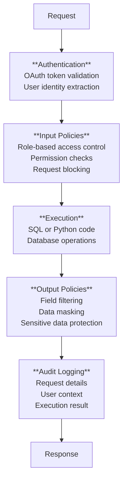

> **Related Topics:** [Configuration](/operations/configuration) (secrets setup) | [Deployment](/operations/deployment) (production security) | [Common Tasks](/reference/common-tasks#security) (quick how-to)

MXCP provides enterprise-grade security features for production AI applications. This section covers authentication, authorization, and audit capabilities.

## Security Features

### Authentication
Control who can access your MCP server:
- **OAuth 2.0** - GitHub, Atlassian, Salesforce, Google, Keycloak
- **Session Management** - Secure token handling with persistence
- **Stateless Mode** - For serverless deployments

[Learn about authentication →](/security/authentication)

### Policies
Control what users can do and see:
- **Input Policies** - Block unauthorized requests
- **Output Policies** - Filter sensitive data
- **CEL Expressions** - Flexible condition evaluation

[Learn about policies →](/security/policies)

### Audit Logging
Track all operations for compliance:
- **Complete Trail** - Every operation logged
- **User Attribution** - Who did what and when
- **Query Interface** - Search and analyze logs

[Learn about auditing →](/security/auditing)

## Security Model

MXCP implements a layered security model:



## Quick Start

### Enable Authentication

Add to your user configuration (`~/.mxcp/config.yml`):

```yaml
mxcp: 1
projects:
  my-project:
    profiles:
      default:
        auth:
          provider: github
          github:
            client_id: "${GITHUB_CLIENT_ID}"
            client_secret: "${GITHUB_CLIENT_SECRET}"
```

### Add Policies

In your endpoint definition:

```yaml
tool:
  name: sensitive_data
  # ...

policies:
  input:
    - condition: "user.role != 'admin'"
      action: deny
      reason: "Admin access required"

  output:
    - condition: "user.role != 'admin'"
      action: filter_fields
      fields: ["salary", "ssn"]
```

### Enable Audit Logging

In `mxcp-site.yml`:

```yaml
profiles:
  default:
    audit:
      enabled: true
      path: audit/logs.jsonl
```

## Best Practices

### 1. Defense in Depth
Use multiple security layers:
- Authentication (who is the user)
- Authorization (what can they do)
- Data filtering (what can they see)
- Audit logging (what did they do)

### 2. Least Privilege
Grant minimum necessary permissions:
```yaml
# Only allow specific permissions
condition: "'data.read' in user.permissions"
```

### 3. Mark Sensitive Data
Use `sensitive: true` for PII:
```yaml
return:
  type: object
  properties:
    ssn:
      type: string
      sensitive: true
```

### 4. Log Everything in Production
Enable audit logging for compliance:
```yaml
audit:
  enabled: true
  path: /var/log/mxcp/audit.jsonl
```

### 5. Regular Log Review
Monitor for anomalies:
```bash
mxcp log --policy deny --since 24h
mxcp log --status error --since 1h
```

## Compliance

MXCP's security features support various compliance requirements:

| Requirement | MXCP Feature |
|-------------|--------------|
| Access Control | OAuth + Policies |
| Data Protection | Sensitive field filtering |
| Audit Trail | Comprehensive logging |
| Data Minimization | Output policies |
| User Consent | Policy enforcement |

## Security Considerations

### Transport Security
- Use HTTPS in production
- Configure TLS for HTTP transport
- Secure WebSocket connections

### Secret Management
- Never commit secrets to version control
- Use Vault or 1Password integration
- Rotate secrets regularly

### Database Security
- Use read-only mode when appropriate
- Limit DuckDB file permissions
- Regular backups

### Network Security
- Restrict network access
- Use firewalls appropriately
- Monitor for suspicious activity

## Next Steps

- [Authentication](/security/authentication) - Configure OAuth providers
- [Policies](/security/policies) - Implement access control
- [Auditing](/security/auditing) - Set up audit logging
