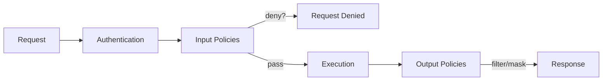

> **Related Topics:** [Authentication](/security/authentication) (user context source) | [Auditing](/security/auditing) (log policy decisions) | [Testing](/quality/testing) (test policies) | [Common Tasks](/reference/common-tasks#how-do-i-restrict-access-to-a-tool) (quick how-to)

MXCP's policy engine provides fine-grained access control for your endpoints. Policies can control who can call endpoints (input policies) and what data they can see (output policies).

## How It Works



1. **Request arrives** with user context from authentication
2. **Input policies** evaluate - any `deny` stops processing
3. **Endpoint executes** if input policies pass
4. **Output policies** filter/mask the response data
5. **Response** returns to client

## Policy Types

### Input Policies
Evaluated **before** endpoint execution:
- Block unauthorized requests
- Validate user permissions
- Enforce business rules

### Output Policies
Evaluated **after** endpoint execution:
- Filter sensitive fields
- Mask data values
- Redact information

## Basic Policy Structure

Policies are defined in endpoint YAML files:

```yaml
tool:
  name: employee_data
  # ... parameters and return ...

  policies:
    input:
      - condition: "user.role != 'hr' && user.role != 'hr_manager'"
        action: deny
        reason: "HR role required"

    output:
      - condition: "user.role != 'hr_manager'"
        action: filter_fields
        fields: ["salary", "ssn"]
        reason: "Sensitive data restricted"
```

## Policy Conditions

Conditions use a CEL-like expression syntax:

### User Context Variables

| Variable | Type | Description |
|----------|------|-------------|
| `user.id` | string | User identifier |
| `user.email` | string | User email address |
| `user.name` | string | User display name |
| `user.role` | string | Primary role |
| `user.permissions` | array | List of permissions |
| `user.groups` | array | Group memberships |

For anonymous users (when no authentication is configured), the user context defaults to:

```json
{
  "role": "anonymous",
  "permissions": [],
  "user_id": null,
  "username": null,
  "email": null,
  "provider": null
}
```

### CEL Context Structure

#### Input Policies

For input policies, the CEL evaluation context contains:

- **`user`** - User context object (see above)
- **All query parameters at the top level** - Direct access to endpoint parameters

Example context for an endpoint with parameters `employee_id` and `department`:
```json
{
  "user": {
    "user_id": "123",
    "role": "admin",
    "permissions": ["employee.read"]
  },
  "employee_id": "emp456",
  "department": "engineering"
}
```

This means you can reference query parameters directly:
```yaml
# Check if user is viewing their own profile
condition: "employee_id != user.user_id && user.role != 'admin'"
```

#### Output Policies

For output policies, the CEL evaluation context contains:

- **`user`** - User context object
- **`response`** - The complete response data from the endpoint

Example context for an employee endpoint response:
```json
{
  "user": {
    "user_id": "123",
    "role": "user",
    "permissions": ["employee.read"]
  },
  "response": {
    "id": "emp456",
    "name": "John Doe",
    "department": "HR",
    "salary": 95000,
    "ssn": "123-45-6789"
  }
}
```

This allows policies based on response content:
```yaml
# Filter salary for HR department employees viewed by non-HR users
condition: "response.department == 'HR' && user.role != 'hr_manager'"
action: filter_fields
fields: ["salary"]
```

### Variable Namespacing

**Important**: There is no overlap between user context and query parameters/response data because:

1. **User context is always nested under `user`**
2. **Query parameters are available at the top level** (input policies only)
3. **Response data is nested under `response`** (output policies only)

This prevents naming conflicts. For example, if an endpoint has a parameter called `role`, it won't conflict with `user.role`:

```yaml
# This condition checks the user's role vs a query parameter
condition: "user.role == 'admin' && role == 'manager'"
```

### Critical Security Warning: "user" Parameter Collision

**NEVER name a query parameter "user"** as this can cause a serious security vulnerability!

If you have a query parameter named `user`, it will be overridden by the user context during policy evaluation. While MXCP now detects and handles this collision (user context takes precedence), this can still cause confusion and potential security issues.

```yaml
# BAD: Don't do this!
parameters:
  - name: user          # This conflicts with user context!
    type: string

# GOOD: Use a different name
parameters:
  - name: user_id       # Clear and no collision
    type: string
  - name: username      # Alternative naming
    type: string
  - name: target_user   # Descriptive naming
    type: string
```

**What happens if you use "user" as a parameter name:**
- MXCP will log a warning about the collision
- The user context will take precedence (secure behavior)
- Your policies will work correctly, but may be confusing
- CLI usage becomes ambiguous (`--param user=...` vs user context)

**Best practice:** Choose descriptive parameter names that don't conflict with reserved namespaces (`user`, `response`).

### Reserved Namespaces

The following variable names are reserved in policy evaluation contexts:

**Input Policies:**
- `user` - User context object (always reserved)
- Any other names are available for query parameters

**Output Policies:**
- `user` - User context object (always reserved)
- `response` - Response data object (always reserved)

**Future-proofing:** While only `user` and `response` are currently reserved, avoid using system-like names such as `system`, `config`, `env`, `request`, `context`, etc. for query parameters to prevent potential conflicts in future versions.

### Comparison Operators

| Operator | Description | Example |
|----------|-------------|---------|
| `==` | Equals | `user.role == 'admin'` |
| `!=` | Not equals | `user.role != 'guest'` |
| `>` | Greater than | `user.level > 5` |
| `<` | Less than | `user.level < 10` |
| `>=` | Greater or equal | `user.age >= 18` |
| `<=` | Less or equal | `user.count <= 100` |

### Logical Operators

| Operator | Description | Example |
|----------|-------------|---------|
| `&&` | And | `user.role == 'admin' && user.verified` |
| `\|\|` | Or | `user.role == 'admin' \|\| user.role == 'manager'` |
| `!` | Not | `!user.banned` |

### String Operations

| Operation | Description | Example |
|-----------|-------------|---------|
| `.contains()` | Contains substring | `user.email.contains('@company.com')` |
| `.startsWith()` | Starts with | `user.id.startsWith('EMP')` |
| `.endsWith()` | Ends with | `user.email.endsWith('.edu')` |

### Array Operations

| Operation | Description | Example |
|-----------|-------------|---------|
| `in` | Item in array | `'admin' in user.roles` |
| `all` | All items match | `user.permissions.all(p, p.startsWith('read'))` |
| `exists` | Any item matches | `user.groups.exists(g, g == 'admins')` |

## CEL Expression Examples

### Basic Role Checks

```yaml
# Allow only admins
condition: "user.role == 'admin'"

# Allow users and admins, but not guests
condition: "user.role in ['user', 'admin']"

# Deny anonymous users
condition: "user.user_id == null"
```

### Permission Checks

```yaml
# Check for specific permission
condition: "'employee.read' in user.permissions"

# Check for multiple permissions (AND)
condition: "'employee.read' in user.permissions && 'employee.write' in user.permissions"

# Check for any of several permissions
condition: "user.permissions.exists(p, p in ['admin', 'manager'])"
```

### Parameter-based Policies

```yaml
# Allow users to only query their own profile
condition: "employee_id != user.user_id && user.role != 'admin'"
action: deny
reason: "Users can only view their own profile"

# Restrict date ranges for non-admins
condition: "user.role != 'admin' && (end_date - start_date).getDays() > 30"
action: deny
reason: "Non-admins can only query up to 30 days of data"
```

### Output-based Policies

```yaml
# Filter fields based on response content
condition: "response.department == 'HR' && user.role != 'hr_manager'"
action: filter_fields
fields: ["salary", "performance_rating"]

# Mask PII for non-privileged users
condition: "!('pii.view' in user.permissions)"
action: mask_fields
fields: ["ssn", "phone", "address"]
```

## Input Policy Actions

### deny
Block the request entirely:

```yaml
input:
  - condition: "!('data.read' in user.permissions)"
    action: deny
    reason: "Missing data.read permission"
```

**Note:** For logging access without blocking, use audit logging instead of policies. See [Auditing](/security/auditing) for details on tracking all access events.

## Output Policy Actions

### deny
Block the response based on its content:

```yaml
output:
  - condition: "response.email.endsWith('@sensitive.com')"
    action: deny
    reason: "Emails from sensitive.com must not be exposed"
```

This is useful when you can't determine access until after seeing the data.

### filter_fields
Remove specific fields from the response:

```yaml
output:
  - condition: "user.role != 'admin'"
    action: filter_fields
    fields: ["ssn", "salary", "internal_notes"]
    reason: "Restricted to admins"
```

### filter_sensitive_fields
Remove all fields marked as `sensitive: true`:

```yaml
output:
  - condition: "!('pii.view' in user.permissions)"
    action: filter_sensitive_fields
    reason: "PII access not authorized"
```

> **Note:** This action requires fields to be marked with `sensitive: true` in your return type schema. See [Data Sensitivity Levels](#data-sensitivity-levels) for an example.

### mask_fields
Replace field values with `"****"`:

```yaml
output:
  - condition: "user.role == 'support'"
    action: mask_fields
    fields: ["email", "phone"]
    reason: "Data masked for support role"
```

## Field Filtering and Masking Behavior

Understanding how field operations work with different data structures:

### Non-Existent Fields

When filtering or masking fields that don't exist in the response, MXCP handles them gracefully:

- **filter_fields**: Non-existent fields are silently ignored (no error)
- **mask_fields**: Non-existent fields are silently ignored (no error)
- **filter_sensitive_fields**: Only filters fields that both exist AND are marked sensitive

This allows you to define broad policies that work across endpoints with different schemas:

```yaml
output:
  # This won't error even if some fields don't exist
  - condition: "user.role == 'basic'"
    action: filter_fields
    fields: ["ssn", "salary", "credit_score", "internal_id"]
    reason: "Restricted fields for basic users"
```

### Array Response Handling

When the response is an array of objects, field filtering/masking is applied to each item:

```yaml
# Response: [{"name": "Alice", "ssn": "123"}, {"name": "Bob", "ssn": "456"}]
# After filter_fields: [{"name": "Alice"}, {"name": "Bob"}]

output:
  - condition: "user.role != 'admin'"
    action: filter_fields
    fields: ["ssn"]
```

### Nested Field Handling

Field operations currently apply to top-level fields only. For nested objects, the entire nested object can be filtered:

```yaml
# Response: {"name": "Alice", "address": {"street": "123 Main", "city": "NYC"}}

output:
  # This removes the entire address object
  - condition: "user.role == 'public'"
    action: filter_fields
    fields: ["address"]
```

### Multiple Policy Actions

When multiple output policies match, they are applied in order. Each policy's action modifies the response for subsequent policies:

```yaml
output:
  # First: mask email for non-admins (replaced with "****")
  - condition: "user.role != 'admin'"
    action: mask_fields
    fields: ["email"]

  # Second: remove salary for non-finance (applied to already-masked response)
  - condition: "user.department != 'finance'"
    action: filter_fields
    fields: ["salary"]
```

## Complete Examples

### Role-Based Access Control

```yaml
tool:
  name: financial_report
  description: Generate financial reports

  policies:
    input:
      # Only finance team can access
      - condition: "user.role != 'finance' && user.role != 'executive'"
        action: deny
        reason: "Finance or executive role required"

    output:
      # Non-executives see summary only
      - condition: "user.role != 'executive'"
        action: filter_fields
        fields: ["detailed_breakdown", "individual_salaries"]
        reason: "Detailed data restricted to executives"
```

### Permission-Based Access

```yaml
tool:
  name: customer_data
  description: Access customer information

  policies:
    input:
      # Require base permission
      - condition: "!('customer.read' in user.permissions)"
        action: deny
        reason: "Missing customer.read permission"

    output:
      # Filter PII without special permission
      - condition: "!('customer.pii' in user.permissions)"
        action: filter_fields
        fields: ["email", "phone", "address"]
        reason: "PII access requires customer.pii permission"

      # Additional filter for financial data
      - condition: "!('customer.financial' in user.permissions)"
        action: filter_fields
        fields: ["credit_card", "bank_account", "credit_score"]
        reason: "Financial data requires customer.financial permission"
```

### Data Sensitivity Levels

```yaml
tool:
  name: employee_record

  return:
    type: object
    properties:
      id:
        type: integer
      name:
        type: string
      email:
        type: string
        sensitive: true
      salary:
        type: number
        sensitive: true
      ssn:
        type: string
        sensitive: true
      department:
        type: string

  policies:
    input:
      - condition: "user.role == 'guest'"
        action: deny
        reason: "Guests cannot access employee records"

    output:
      # Remove all sensitive fields for non-HR
      - condition: "user.role != 'hr'"
        action: filter_sensitive_fields
        reason: "HR role required for sensitive data"
```

### Conditional Field Access

```yaml
tool:
  name: project_details

  policies:
    output:
      # Team members see their own projects only
      - condition: "user.role == 'member' && !response.team_members.contains(user.id)"
        action: deny
        reason: "Can only view your own projects"

      # Contractors see limited info
      - condition: "user.type == 'contractor'"
        action: filter_fields
        fields: ["budget", "internal_roadmap", "client_contacts"]
        reason: "Contractor access limited"
```

## Using Policies with Different Commands

### With `mxcp serve`

When running MXCP in server mode with authentication enabled, the user context is automatically populated from the OAuth token:

```bash
mxcp serve --profile production
```

The auth middleware extracts user information and makes it available to policies.

### With `mxcp run`

For command-line execution, provide user context manually with `--user-context`.

### With `mxcp test`

The test command supports user context in test definitions via `user_context:` field. Tests can validate both policy enforcement and filtered output.

## Testing Policies

### Command Line Testing

Test with simulated user context:

```bash
# Test as regular user
mxcp run tool employee_data \
  --param employee_id=123 \
  --user-context '{"role": "user", "permissions": ["data.read"]}'

# Test as admin
mxcp run tool employee_data \
  --param employee_id=123 \
  --user-context '{"role": "admin", "permissions": ["data.read", "pii.view"]}'

# Test denied access
mxcp run tool employee_data \
  --param employee_id=123 \
  --user-context '{"role": "guest"}'

# Load user context from file
mxcp run tool employee_data \
  --param employee_id=123 \
  --user-context @user_context.json
```

Example `user_context.json`:
```json
{
  "user_id": "456",
  "role": "admin",
  "permissions": ["employee.read", "pii.view"]
}
```

### YAML Test Cases

Add policy tests to your endpoint:

```yaml
tool:
  name: sensitive_tool

  tests:
    - name: admin_full_access
      description: Admin sees all fields
      arguments:
        - key: id
          value: 1
      user_context:
        role: admin
        permissions: ["all"]
      result_contains:
        salary: 85000
        ssn: "123-45-6789"

    - name: user_filtered_access
      description: Regular user sees filtered data
      arguments:
        - key: id
          value: 1
      user_context:
        role: user
        permissions: ["data.read"]
      result_not_contains:
        - salary
        - ssn
```

Note: Policy denial tests cannot be directly tested via YAML test assertions. Use CLI testing with `--user-context` to verify deny policies work correctly.

## Policy Evaluation Order

Policies are evaluated in order:

1. **Input policies** - Top to bottom
   - First `deny` stops execution immediately
   - Remaining policies are skipped

2. **Endpoint execution** - Only if all input policies pass

3. **Output policies** - Top to bottom
   - All matching policies applied
   - Fields filtered/masked cumulatively

## SQL User Functions

Access user context in SQL queries when running through `mxcp serve`:

```sql
SELECT *
FROM data
WHERE
  created_by = get_username()
  OR get_user_provider() = 'admin'
```

Available functions:
- `get_username()` - User's display name
- `get_user_email()` - User's email address
- `get_user_provider()` - OAuth provider name (github, google, etc.)
- `get_user_external_token()` - OAuth provider token for API calls
- `get_request_header(name)` - Get a specific HTTP request header
- `get_request_headers_json()` - Get all request headers as JSON

**Note:** These functions are only available when endpoints are executed through `mxcp serve`. They return NULL when run via `mxcp run`.

## Best Practices

### 1. Fail Secure
Default to denying access when in doubt:

```yaml
# Good: Explicitly allow known roles
input:
  - condition: "!(user.role in ['admin', 'manager', 'user'])"
    action: deny
    reason: "Unknown role - access denied"

# Avoid: Only denying specific roles (might miss new roles)
input:
  - condition: "user.role == 'guest'"
    action: deny
    reason: "Guests not allowed"
```

### 2. Explicit Permission Checks
Require specific permissions:

```yaml
input:
  - condition: "!('data.read' in user.permissions)"
    action: deny
    reason: "data.read permission required"
```

### 3. Clear Reasons
Provide helpful error messages:

```yaml
# Good
reason: "Finance role required. Contact your manager for access."

# Avoid
reason: "Denied"
```

### 4. Layer Policies
Use multiple policies for clarity:

```yaml
input:
  # Authentication check
  - condition: "user.id == ''"
    action: deny
    reason: "Authentication required"

  # Role check
  - condition: "user.role == 'guest'"
    action: deny
    reason: "Guest access not allowed"

  # Permission check
  - condition: "!('data.read' in user.permissions)"
    action: deny
    reason: "Missing data.read permission"
```

### 5. Use Sensitive Markers
Mark sensitive fields in schema:

```yaml
return:
  type: object
  properties:
    ssn:
      type: string
      sensitive: true  # Easy to filter with filter_sensitive_fields
```

### 6. Test Thoroughly
Test all user roles and edge cases.

## Advanced Examples

### Dynamic Field Filtering Based on Relationship

Filter data based on user relationships:

```yaml
output:
  # Users can see full details of their direct reports
  - condition: |
      user.role == 'manager' &&
      !response.exists(r, r.manager_id == user.user_id)
    action: filter_fields
    fields: ["salary", "performance_rating", "personal_goals"]
```

### Time-based Access Control

Restrict access during off-hours:

```yaml
input:
  # Restrict access during off-hours for non-admins
  - condition: |
      user.role != 'admin' &&
      (timestamp.now().getHours() < 8 || timestamp.now().getHours() > 18)
    action: deny
    reason: "Access restricted to business hours (8 AM - 6 PM)"
```

### Conditional Data Masking

Mask data based on multiple conditions:

```yaml
output:
  # Mask data based on security clearance (all masked to "****")
  - condition: |
      response.security_clearance > user.security_clearance ||
      (response.classified && !('classified.view' in user.permissions))
    action: mask_fields
    fields: ["details", "location", "contacts"]
```

## Troubleshooting

### Policy Not Being Applied

1. Check that the endpoint YAML has valid syntax
2. Verify the condition expression is valid CEL
3. Check logs for policy evaluation errors
4. Ensure user context is being passed correctly

### CEL Expression Errors

Common issues:
- String comparisons are case-sensitive
- Use `in` for list membership, not `contains`
- Null checks should use `== null`, not `!exists`

### "Policy evaluation failed"
- Check condition syntax
- Verify user context fields exist
- Test with debug mode

### "Field not filtered"
- Verify field name matches exactly
- Check policy condition evaluates correctly
- Ensure policy order is correct

### "Unexpected deny"
- Review policy conditions
- Check user context values
- Use `--debug` flag

### Performance Considerations

- Keep CEL expressions simple for better performance
- Filter fields at the output stage rather than fetching and then denying
- Consider caching policy evaluation results for repeated queries

## Next Steps

- [Authentication](/security/authentication) - Configure user context source
- [Auditing](/security/auditing) - Log policy decisions
- [Testing](/quality/testing) - Test policies comprehensively
